# Orion: Admission-Aware Cascades for Graph-Based Approximate Nearest Neighbor Search

<!-- Badges: the Coverage % is STATIC until Codecov is wired up.
     (A live AVX-512 CI badge was dropped — shields.io 404s on a
     private repo and GitHub's native badge wouldn't render over
     the user's network; re-add it once the repo is public.)

       Coverage (after configuring Codecov upload in avx512.yml —
       add `codecov/codecov-action@v4` step on the `build-and-test`
       job, then use):
         https://img.shields.io/codecov/c/github/ChanchunhouZEON/Orion?label=coverage&logo=codecov&logoColor=white

     The current static Coverage badge reflects the local result
     of `cargo llvm-cov --workspace --lib --summary-only` —
     re-run that after substantial changes and update the
     hardcoded `46%` below until Codecov is wired up. -->

[](benchmark/scripts/ci_smoke_sift.sh)
[](#testing)
[-success?logo=codecov&logoColor=white)](#coverage)
[](#license)
[](rust-toolchain.toml)

[](#platforms)
[](#platforms)
[](orion_py/)
[](#)

## TL;DR

- **Orion** is a graph-ANN engine that attacks two structural wastes the standard beam loop shares across DiskANN, HNSW, and ParlayANN — *step waste* (over-evaluation after convergence) and *precision waste* (`f32` where popcount would do) — inside a **single beam pass**.
- One **PhasedGraph** layout (local / remote / extra zones) + one **reversible admission-rate predicate** + one **auto-calibrated gap-based early-exit** + one **three-axis composable cascade** (`--prefilter / --admission / --rerank`), with a deterministic `(N, D, metric)` → cascade selector picked at index-open time.
- Apple Silicon NEON + x86_64 AVX-512 SIMD kernels, 85 % line coverage on the two authored crates, in-memory only.
- **Headline: 3.8–8.1× over USearch HNSW at R ≥ 0.95** across the 6-dataset panel (SIFT, GIST, GloVe-25, GloVe-100, Deep10M, MSMARCO-BERT). Versus ParlayANN Vamana on the same PA-built base graph: **1.12–1.52× at R ≥ 0.9**.
- A separation result in the paper establishes that **admission history is the minimum sufficient signal** for the early-exit decision — any history-blind rule is provably less precise at the same recall.

## Table of contents

- [Quick Start](#quick-start) — [Prerequisites](#prerequisites) · [Build](#build) · [Per-dataset quick sweep](#per-dataset-quick-sweep) · [PA base-graph prep](#one-time-pa-base-graph-prep) · [3-engine head-to-head](#full-3-engine-head-to-head-thermal-isolated-3-run-median) · [Plot](#plot-the-comparison) · [Tuning knobs](#tuning-knobs-env-vars-most-used)
- **Deep dives** in [`docs/`](docs/) — separated for navigation:
    - [Architecture](docs/architecture.md) — PhasedGraph layout, distance-percentile split, admission-rate convergence detector, distance-sorted candidate slab, build-time distance maintenance
    - [Key Optimizations](docs/optimizations.md) — memory efficiency + 6-tier search-phase pipeline (per-query prep, warm-up 3-hop peel, prefilter / admission / rerank / shared kernels)
    - [Configuration](docs/configuration.md) — per-dataset YAML, file structure, cascade vs `metric` field, auto-calibration
    - [Code Structure](docs/code-structure.md) — full workspace tree
- [Benchmark Results](#benchmark-results) — per-dataset 3-engine sweeps, baseline panels, ADSampling overlay
- [Convergence-side Ablation](#convergence-side-ablation) · [Cascade-Stage Ablation](#cascade-stage-ablation) — 2×2 factorial on early-stop × extras + cascade-tier isolation
- [Build Overhead](#build-overhead) · [Memory](#memory) · [Auto-Calibration](#auto-calibration-analysis) · [Convergence](#convergence--early-exit-analysis) — diagnostic studies
- [Testing](#testing) · [Coverage](#coverage) · [Platforms](#platforms) · [License](#license)

## Core Idea

The standard graph-ANN beam-search loop wastes work in two structural ways:

1. **Step waste.** Once the beam has converged to the query's neighborhood, the admission rate into the priority queue collapses below ≈15 %. The loop nonetheless re-evaluates every out-neighbor at full precision on every subsequent step.
2. **Precision waste.** Every neighbor is evaluated at `f32` precision even when a single-cache-line popcount over a sketch would clearly reject it.

DiskANN, HNSW, and ParlayANN each tackle one waste partially; **Orion attacks both simultaneously** in a single beam loop via four interlocking mechanisms:

- **PhasedGraph layout.** Each vertex's out-edges are partitioned at build time, by build-time distance, into three zones — **local** (top-X % nearest), **remote** (long-range shortcuts), and **extra** (pruned-loser candidates retained beyond the graph degree). Layout enables zone-selective traversal without changing the underlying graph.
- **Reversible admission-rate predicate.** A per-step indicator over the priority-queue's admit-rate detects beam convergence and switches the loop from **full-graph navigation** (`local ∪ remote`) to **local-∪-extra reranking**. The predicate is reversible — one false-positive converged step doesn't lock out navigation — so recall is preserved on hard queries.
- **Auto-calibrated gap-based early exit.** From the gap distribution between admissions during a 200-query calibration pass, Orion derives a P95 cutoff (`early_exit_limit`) at which the beam terminates once N consecutive zero-admission steps occur. No per-dataset tuning.
- **Three-axis composable cascade** (`--prefilter / --admission / --rerank`). Extends ParlayANN's CLI-level cascade with a kernel-trick L2 admission tier, RaBitQ-B1/B4 and JL-Hadamard prefilters, and a deterministic `(N, D, metric)` → cascade-triple selector that picks the pipeline at index-open time (no per-dataset scripts).

A separation result in the paper establishes that **admission history is the minimum sufficient signal** for the early-exit decision: any history-blind rule is provably less precise at the same recall.

## Quick Start

### Prerequisites

- Rust toolchain (1.75+)
- Apple Silicon / aarch64 Linux for the NEON distance kernels; `-C target-cpu=native` enabled
- Dataset fvecs under `data/<dataset>/` (see `data/convert_hdf5.py` for glove conversion; GloVe variants are expected **pre-normalized** under `data/glove{25,100}_norm/`)
- **Recommended**: clone our ParlayANN fork at [`ChanchunhouZEON/ParlayANN-staged`](https://github.com/ChanchunhouZEON/ParlayANN-staged) as a sibling directory. The fork adds the `.staged v2` export format (`-staged_outfile` flag + `staged_export.h`) that Orion's `parlayann_bridge` imports — upstream ParlayANN doesn't ship this exporter, so this fork is **required** for the `ORION_GRAPH=pa` cache path and the 3-engine head-to-head sweep. Override the location with `PA_ROOT=<path>`.

  ```sh
  cd ..
  git clone https://github.com/ChanchunhouZEON/ParlayANN-staged.git ParlayANN
  cd ParlayANN/algorithms/vamana
  make                                  # builds the `neighbors` bin
  ```
  The fork's directory name (`ParlayANN-staged` on GitHub) is cloned into `../ParlayANN` here so `PA_ROOT=../ParlayANN` (the default) and every YAML path in `benchmark/configs/sweep.yaml` referring to `${PA_ROOT}/data/<ds>/…_ex16_pct60.staged` resolves out-of-the-box. If you keep the GitHub directory name verbatim, pass `PA_ROOT=../ParlayANN-staged` to every script.
- Python 3.9+ for the visualization + helper scripts. Install the deps with `python3 -m pip install -r requirements.txt`. Every wrapper script under `benchmark/scripts/` honors a `PY=/path/to/python` override (default: whatever `python3` resolves to on `$PATH`) — point it at the interpreter you installed the requirements into, e.g.

  ```sh
  PY=/opt/venvs/orion/bin/python bash benchmark/scripts/run_ablations.sh
  ```

### Build

```sh
git clone https://github.com/ChanchunhouZEON/Orion.git
cd Orion
cargo build --release --bin benchmark --bin orion
```

If you also cloned `ParlayANN-staged` as a sibling (see [Prerequisites](#prerequisites)) the production PA-graph load path works out of the box; otherwise the engine transparently falls back to an in-process Vamana build on first run.

### Per-dataset quick sweep

The `orion` binary is the production driver — loads the cached `PhasedGraph` (or builds it on first run), auto-calibrates, and prints a QPS/Recall curve across the standard 14-value `L` schedule. Search dispatch goes through the **composable cascade** (`--prefilter`, `--admission`, `--rerank`); per-dataset defaults pick the production triple automatically.

```sh
# SIFT1M — defaults to (none, l2-u8, f32) — direct u8 L2, no prefilter
{ORION_GRAPH=pa} {ORION_STAGED_FILE=$PA_ROOT/data/<ds>/<ds>_ex16_pct60.staged} cargo run --release --bin orion -- sift

# GloVe-25 — defaults to (none, mips-i8, ip-f32) — MIPS i8 sdot
{ORION_GRAPH=pa} {ORION_STAGED_FILE=$PA_ROOT/data/<ds>/<ds>_ex16_pct60.staged} cargo run --release --bin orion -- glove25

# GloVe-100 — defaults to (none, mips-i8, ip-f32)
{ORION_GRAPH=pa} {ORION_STAGED_FILE=$PA_ROOT/data/<ds>/<ds>_ex16_pct60.staged} cargo run --release --bin orion -- glove100

# GIST — defaults to (jl, l2-kt, f32) — JL prefilter + i8 kernel-trick L2
{ORION_GRAPH=pa} {ORION_STAGED_FILE=$PA_ROOT/data/<ds>/<ds>_ex16_pct60.staged} cargo run --release --bin orion -- gist
```

**Cascade axes** (override any of the three independently):

- `--prefilter <none|jl|jl-hadamard|rabitq>` — optional cheap rejection tier.
- `--admission <l2-u8|l2-u16|l2-kt|mips-i8|mips-i16>` — the PQ-ranked admission distance.
- `--rerank <f32|ip-f32|u16>` — final precision pass at end-of-beam.

Prefetch tuning lives in three env vars: `ORION_DSTREAM_LA_Q` (per-iter L1 lookahead, default 10), `ORION_DSTREAM_LA_TRUTH` (rerank pass lookahead, default 6), `ORION_DSTREAM_SINK_BURST` (sink-time long-range burst, default 12 — calibrated for GIST L2-KT, +20-27% QPS vs disabled).

### One-time PA base-graph prep

The yaml points every dataset at `${PA_ROOT}/data/<ds>/<stub>.staged`. Generate these with the `prepare_parlayann_data.sh` helper (≈ 4–10 min on the 1M-class sets, ~30 min on Deep10M). `PA_ROOT` defaults to the recommended sibling clone `../ParlayANN`; if your checkout lives elsewhere (e.g. the verbatim `../ParlayANN-staged` directory name), prefix each command with `PA_ROOT=<path>`:

```sh
PA_NUM_PASSES=2 DATASET=sift     bash benchmark/scripts/prepare_parlayann_data.sh
PA_NUM_PASSES=2 DATASET=glove25  bash benchmark/scripts/prepare_parlayann_data.sh
PA_NUM_PASSES=2 DATASET=glove100 bash benchmark/scripts/prepare_parlayann_data.sh
PA_NUM_PASSES=2 DATASET=gist     bash benchmark/scripts/prepare_parlayann_data.sh
PA_NUM_PASSES=2 DATASET=deep10m  bash benchmark/scripts/prepare_parlayann_data.sh
```

#### Deep10M — sourcing the data

Yandex Deep10M (the first 10M of Deep1B, used for L2 ground truth) is published as `.fbin` files via the [BigANN benchmark](https://big-ann-benchmarks.com/) and the [Yandex Research Datasets](https://research.yandex.com/datasets/biganns) page. After downloading `base.10M.fbin`, `query.public.10K.fbin`, and the matching `gt.public.10K.bin`, convert to fvecs/ivecs with `data/convert_fbin.py`:

```sh
mkdir -p data/deep10m
python3 data/convert_fbin.py --vec --pad-to-dim 128 /path/to/base.10M.fbin           data/deep10m/deep10m_base.fvecs
python3 data/convert_fbin.py --vec --pad-to-dim 128 /path/to/query.public.10K.fbin   data/deep10m/deep10m_query.fvecs
# The published groundtruth (groundtruth.public.10K.ibin) references the
# **full 1B base**; for the 10M subset we must recompute brute-force GT
# from the 10M base.
python3 benchmark/scripts/compute_gt_brute.py \
    --base-fbin  /path/to/base.10M.fbin \
    --query-fbin /path/to/query.public.10K.fbin \
    --out        data/deep10m/gt.bin \
    -k 100
python3 -c "import struct, numpy as np
nq, k = struct.unpack('<II', open('data/deep10m/gt.bin','rb').read(8))
ids = np.fromfile('data/deep10m/gt.bin', dtype=np.uint32, count=nq*k, offset=8).reshape(nq, k)
with open('data/deep10m/deep10m_groundtruth.ivecs','wb') as f:
    for row in ids.astype(np.int32):
        f.write(np.array([k], dtype=np.int32).tobytes() + row.tobytes())"
```

Why `--pad-to-dim 128` rather than the next-supported 100: **the f32 rerank's `compute_bytes` is rounded up to a 32-byte multiple**, so on a D=100 base (stride 400 bytes) the kernel reads 416 bytes per vertex — crossing the vertex boundary by 16 bytes and corrupting every rerank distance. D=128 gives `stride == compute_bytes == 512` (16 × 32 B), no overrun. Zero padding contributes 0 to L2 — bit-identical ranking to the native D=96 path. The converter streams in 64K-vector chunks so the 3.8 GB base file doesn't have to fit in RAM. PA's build params (`-R 64 -L 128 -alpha 1.05 -num_passes 2 -dist_func Euclidian -quantize_bits 8`) are mirrored verbatim from `../ParlayANN/algorithms/vamana/scripts/deep10M`.

On first `orion` run per dataset, the `.staged` export is imported into `cache/orion_parlayann/*.pgraph` (≈ 3 s on 1M class, ~30 s on Deep10M) and reused thereafter.

### Full 3-engine head-to-head (thermal-isolated, 3-run median)

For paper-grade numbers with thermal-isolated cooldowns + 3-run median, use the unified three-engine sweep driver. It runs **Orion** (cascade auto-picked by dataset, via `target/release/orion`), **Microsoft DiskANN** (via the in-process `target/release/diskann_sweep` wrapping the `diskann` core crate), and **ParlayANN Vamana** (PA's published per-dataset recipe) back-to-back on the same Vamana graph topology (R / L<sub>build</sub> / α / num_passes verbatim from `../ParlayANN/algorithms/vamana/scripts/<ds>`). Results are written to `visualizations/sweep_orion_vs_parlayann_<ds>.json` with three series — `orion`, `diskann`, `parlayann` — consumed by `visualizations/plot_dataset_all.py`:

```sh
PA_ROOT=/path/to/ParlayANN DATASET=glove100 NUM_RUNS=3 COOLDOWN_S=180 \
    bash benchmark/scripts/sweep_orion_vs_diskann_vs_parlayann.sh
```

`COOLDOWN_S=60` (or `1` on systems with negligible thermal drift) is fine for iteration; bump to 180 for paper plots.

**Metric note for the DiskANN row**: the `diskann` core crate's f32 distance kernel only ships L2 (`Cosine` panics at runtime — see `vector/src/distance.rs:57`). For datasets whose intended ranking is cosine / MIPS (`glove*`, `msmarco_bert_1M`, `wiki_ada_1M`) `diskann_sweep` L2-normalises the input vectors before handing them to DiskANN — L2 on unit-norm vectors = cosine ranking. This is apples-to-apples on the pre-normalised GloVe datasets and on the L2-native ones (SIFT / GIST / Deep10M / Fashion-MNIST). On `msmarco_bert_1M` specifically, GT was brute-forced as **raw** MIPS (dot product on non-unit BERT vectors); DiskANN's cosine ranking diverges from raw MIPS, so the DiskANN row caps at R ≈ 0.52 on that dataset (a metric-mismatch artifact, not a DiskANN deficiency).

### Plot the comparison

After the sweep JSON exists:

```sh
# Single dataset (writes visualizations/qps_recall_<dataset>_all3.png)
DATASET=glove100 python3 visualizations/plot_dataset_all.py

# Batch — every public dataset. Six PNGs in one shot.
python3 visualizations/plot_dataset_all.py --all
```

Each PNG overlays three engines — **Orion** (sky-blue, square markers, "ours"), **ParlayANN Vamana** (rose, diamonds), **Microsoft DiskANN** (amber, triangles) — on a shared log-scale QPS axis. Palette + linewidth are tuned for high contrast in dense overlap zones (see `visualizations/chart_style.py:PALETTE_VIVID`).

### Tuning knobs (env vars, most-used)

| Var                   | Effect                                                                                                                                                          | Typical value                                  |
| --------------------- | --------------------------------------------------------------------------------------------------------------------------------------------------------------- | ---------------------------------------------- |
| `ORION_DSTREAM_LA_Q` | Prefetch lookahead per SIMD iter in quantized dataset(filter phase)                                                                                             | Empirical best value is about `12`             |
| `ORION_DSTREAM_LA_T` | Prefetch lookahead per SIMD iter in full dataset(rerank phase)                                                                                                  | Empirical best value is about `6`              |
| `ORION_USE_FILTER`   | Use pre-filter for reducing the computation at full-distance computation and full-distance priority queue insertion(*only used in non-q metrics like l2\|mips*) | True                                           |
| `PA_ROOT`             | Where to resolve `${PA_ROOT}` in yaml                                                                                                                           | Location of our forked version  of `ParlayANN` |
| `COOLDOWN_S`          | Sleep between & before sweep runs                                                                                                                               | `60` fast iteration, `180` final measurement   |

## Architecture

PhasedGraph layout, distance-percentile split, admission-rate convergence detector, distance-sorted candidate slab, build-time distance maintenance — see [`docs/architecture.md`](docs/architecture.md).


## Key Optimizations

Memory efficiency + 6-tier search-phase pipeline (per-query prep, warm-up 3-hop peel, prefilter / admission / rerank / shared kernels) — see [`docs/optimizations.md`](docs/optimizations.md).


## Configuration

Per-dataset YAML schema, PA-aligned build params, file structure, `metric` field vs cascade, auto-calibration semantics — see [`docs/configuration.md`](docs/configuration.md).


## Benchmark Results

<!-- Per-dataset 3-engine sweeps + baselines stay visible — these are the headline numbers. -->

Three engines, six datasets, one Vamana graph per dataset. Each dataset is evaluated as a **3-engine curve** — **Microsoft Vamana** (in-memory, via the `diskann` core crate), **ParlayANN Vamana** (PA's published per-dataset recipe), and **Orion (ours)** — on the same Vamana graph topology (identical `R / L_build / α / num_passes`, per `benchmark/scripts/prepare_parlayann_data.sh`). 8 threads, k = 10. Raw per-run data lives in `visualizations/sweep_orion_vs_parlayann_<dataset>.json`; curves are rendered with `visualizations/plot_dataset_all.py --all`. Fashion-MNIST (60 K × 784) is excluded from the headline figures — at that scale PA's tighter beam termination wins, and the figure suppresses the regime to keep the headline curves on the production-class workloads.

**Cache-flush parity:** every timed trial — all three engines — is preceded by a PA-style 40 MB SLC eviction (`flush_cache()` mirrors the routine in `ParlayANN/algorithms/utils/check_nn_recall.h`). All three observe an identical cold-cache start condition per L; the comparison reports steady-state per-query work, not first-query warm-cache bias.

**Note on the "Microsoft Vamana" label.** We run the in-memory variant of Microsoft's Rust port. The "DiskANN" name historically refers to the SSD-resident pipeline; in-memory Vamana is the algorithm both Microsoft and ParlayANN actually share. The chart legend uses **Microsoft Vamana** rather than "Microsoft DiskANN" so the apples-to-apples framing stays honest.

### SIFT1M — L2, 1 M × 128-dim

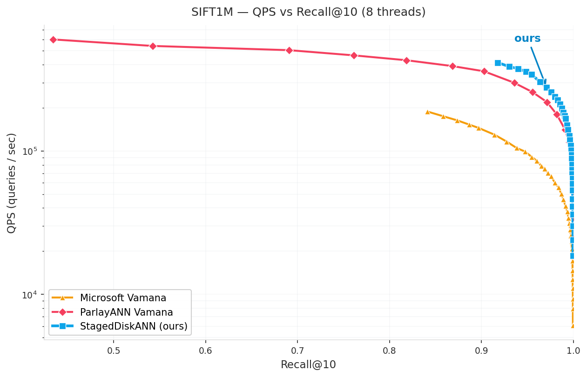

The L2 reference workload: `none → l2-u8 → f32` cascade, 4-way NEON unroll, 3-way merge routing, `PF_BATCH = 8`. All three engines reach R = 0.999, with Orion out front across the entire mid-band.

| Recall | Orion | ParlayANN Vamana | Microsoft Vamana | **Orion / PA** | **Orion / MV** |
|---|---|---|---|---|---|
| R ≥ 0.90 | 414 K | 360 K | 130 K | **1.15×** | **3.19×** |
| R ≥ 0.95 | 341 K | 257 K | 91 K | **1.32×** | **3.75×** |
| R ≥ 0.97 | 277 K | 219 K | 70 K | **1.26×** | **3.95×** |
| R ≥ 0.99 | 176 K | 141 K | 41 K | **1.24×** | **4.26×** |
| R ≥ 0.995 | 128 K | 115 K | 31 K | **1.12×** | **4.09×** |
| R ≥ 0.999 | 59 K | 59 K | 15 K | 1.00× | **4.06×** |

Mid-band win range **1.12× – 1.32×** vs PA, **3.2× – 4.3×** vs Microsoft Vamana. The R = 0.999 tail ties PA — both engines bottleneck on the same f32 rerank step there, and our convergence advantage saturates.

#### Wider baseline panel — Orion + Vamana family + IVF / tree indices

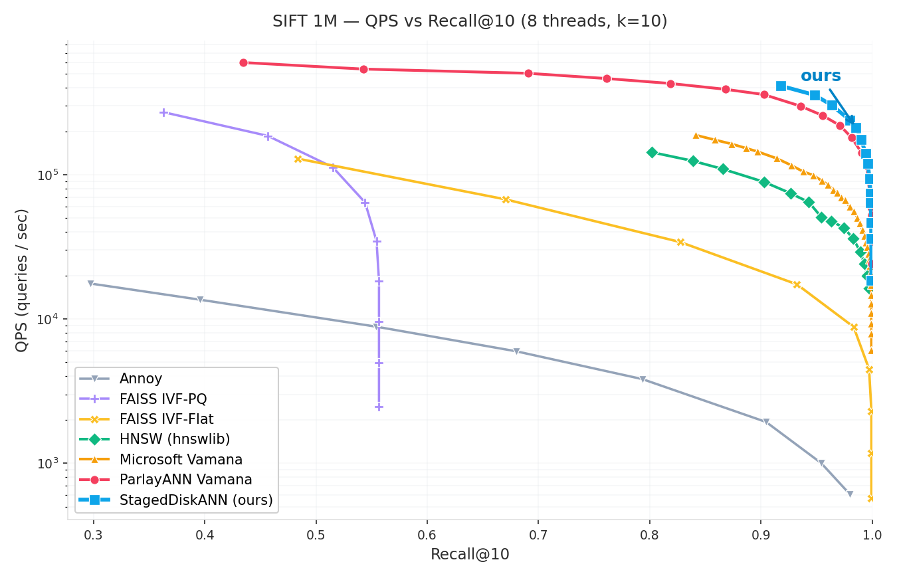

To establish where Orion sits versus the broader ANN-Benchmarks lineup, the same SIFT 1M cascade is rerun at 8 threads alongside four off-the-shelf indices — **HNSW (hnswlib)**, **FAISS IVF-Flat**, **FAISS IVF-PQ (m=16)**, **Annoy (50 trees)** — plus the three Vamana engines from the head-to-head above. All seven series share the same query batch and recall metric.

Reproduce with [`benchmark/scripts/run_sift_baseline_panel.sh`](benchmark/scripts/run_sift_baseline_panel.sh): drives `baseline_comparison.py` (HNSW + reads `sweep_orion_vs_parlayann_sift.json` for Orion / DiskANN / PA via `--no-rust`) and `additional_baselines.py` (FAISS x2 + Annoy), merging into `visualizations/baseline_sift.json`; `plot_baseline_comparison.py` renders the combined panel.

| Algorithm | Peak QPS in usable recall band (R ≥ 0.85) | First QPS at R ≥ 0.97 | Build time |
|---|---:|---:|---:|
| **Orion** (`none → l2-u8 → f32`) | **414 K @ R = 0.92** | **277 K** | (see [Build Overhead](#build-overhead)) |
| ParlayANN Vamana (PA `vamana/scripts/sift`) | 391 K @ R = 0.87 | 219 K | — |
| Microsoft Vamana (in-memory `diskann` crate, α-matched) | 188 K @ R = 0.84 | 70 K | — |
| HNSW (hnswlib, M=16, efC=200) | 89 K @ R = 0.90 | 43 K | 44.6 s |
| FAISS IVF-Flat (nlist=256) | n/a (peak QPS 129 K is at R = 0.48) | 8.8 K | 0.4 s |
| FAISS IVF-PQ (nlist=256, m=16) | n/a (peak QPS 271 K is at R = 0.36) | **plateaus at R = 0.56** | 2.7 s |
| Annoy (n_trees=50) | 1.9 K @ R = 0.90 | 607 | 9.8 s |

- **Orion leads every other index across the entire usable recall band.** At R ≥ 0.97 the gap is **1.27× vs ParlayANN, 4.0× vs Microsoft Vamana, 6.4× vs HNSW, 31× vs FAISS IVF-Flat, 456× vs Annoy.** FAISS IVF-PQ at m=16 can't reach R ≥ 0.57 at all — its 16-byte product code throws away too much precision for SIFT's tight ground-truth clusters.
- **HNSW is the strongest off-the-shelf baseline** but pays for it at high recall: its log-scale efC search runs into the same convergence-rate floor Vamana hits — at R ≈ 0.99 HNSW serves 24 K QPS vs Orion's 176 K (7.3× gap).
- **The IVF / tree indices saturate fast.** FAISS IVF-Flat's peak QPS (129 K) lands at R = 0.48 — pushing recall higher requires linearly more `nprobe`, and by R = 0.98 nprobe = 16 already touches 6.25 % of the dataset on a flat L2 walk. Annoy's 50-tree forest peaks at 17.6 K QPS at R = 0.30 — competitive only at very low recall and slow above R = 0.9 because each `search_k` expansion linearly multiplies the per-tree traversal cost.

### GloVe-25 — MIPS, 1.18 M × 32-dim

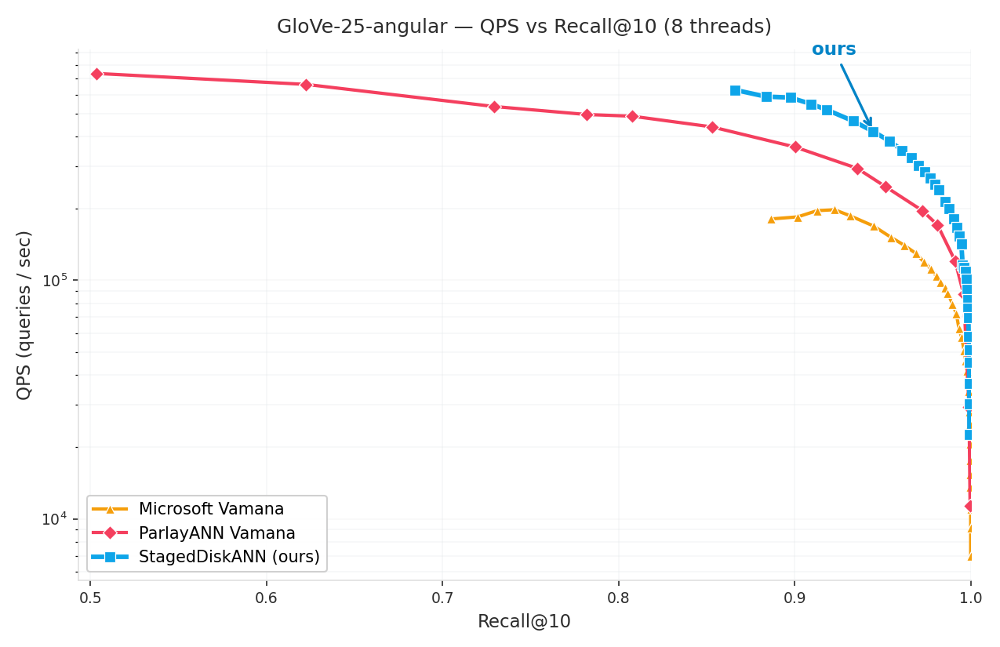

Low-dim angular. At 32 dims the vertex fits in a single cache line, so the cascade defaults to `none → mips-i8 → ip-f32` (single-phase i8 sdot, no prefilter). The largest lead in the bench.

| Recall | Orion | ParlayANN Vamana | Microsoft Vamana | **Orion / PA** | **Orion / MV** |
|---|---|---|---|---|---|
| R ≥ 0.90 | 548 K | 362 K | 184 K | **1.52×** | **2.98×** |
| R ≥ 0.95 | 383 K | 247 K | 151 K | **1.55×** | **2.53×** |
| R ≥ 0.97 | 303 K | 196 K | 119 K | **1.55×** | **2.55×** |
| R ≥ 0.99 | 182 K | 120 K | 73 K | **1.51×** | **2.50×** |
| R ≥ 0.995 | 115 K | 87 K | 51 K | **1.32×** | **2.28×** |
| R ≥ 0.999 | 51 K | 29 K | 31 K | **1.73×** | **1.66×** |

**Uniform 1.3× – 1.7× lead** vs PA across the curve, peaking at R ≥ 0.999 where PA's u16-quantized beam saturates while our auto-calibrated `early_exit_limit` stops as soon as useful admissions dry up.

### GloVe-100 — MIPS, 1.18 M × 100-dim

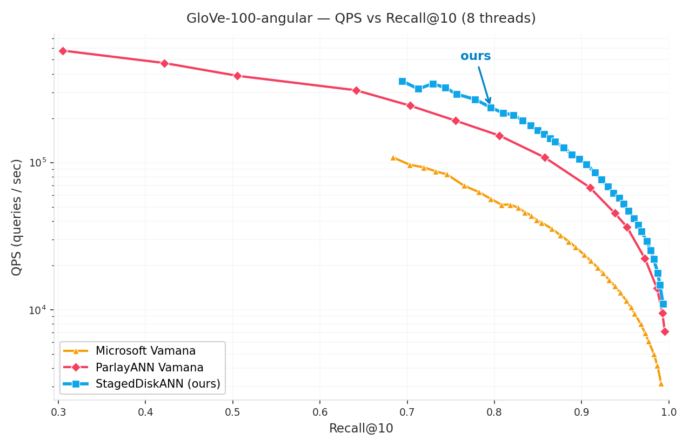

The headline angular-stack result. 100-dim normalized vectors push the pipeline into the memory-bound regime; every optimization listed in the [Search-Phase Optimizations](docs/optimizations.md#search-phase-optimizations) section — `mips-i8` admission (1 cache-line / vertex via `sdot`), `AlignedBoxWithSlice` 32-byte stride, loop peeling, `ip-f32` rerank with prefetch-next, `pad16` PQ buffer, refit `K·8 / K·1.5` merge routing — contributes. Cascade: `none → mips-i8 → ip-f32`.

| Recall | Orion | ParlayANN Vamana | Microsoft Vamana | **Orion / PA** | **Orion / MV** |
|---|---|---|---|---|---|
| R ≥ 0.85 | 156 K | 108 K | 39 K | **1.45×** | **4.00×** |
| R ≥ 0.90 | 97 K | 68 K | 24 K | **1.44×** | **4.12×** |
| R ≥ 0.93 | 69 K | 45 K | 16 K | **1.52×** | **4.30×** |
| R ≥ 0.95 | 47 K | 37 K | 12 K | **1.29×** | **4.08×** |
| R ≥ 0.97 | 29 K | 22 K | 7 K | **1.31×** | **4.23×** |
| R ≥ 0.99 | 11 K | 10 K | 3 K | **1.16×** | **3.47×** |

**1.16× – 1.52× over PA, 3.5× – 4.3× over Microsoft Vamana** in the productive band. Orion tops out at R ≈ 0.993; PA carries to R ≈ 0.995 with progressively smaller per-L gains.

### GIST — L2, 1 M × 960-dim

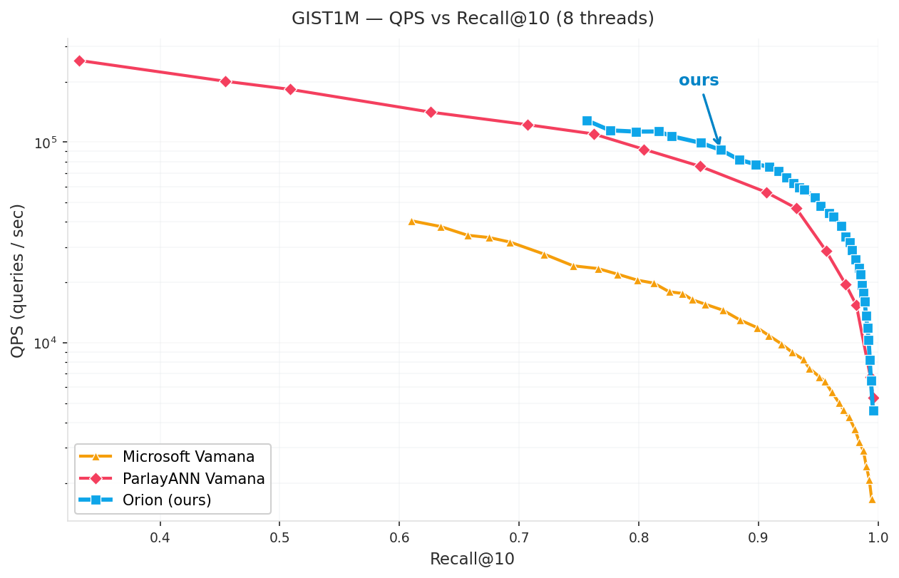

960-D image embeddings — bandwidth-bound, JL prefilter pays off. Cascade: `jl → l2-kt → f32` (kernel-trick L2: i8 base + per-vertex `‖x‖²` sidecar → recover `‖q-x‖²` via `sdot`).

| Recall   | Orion | ParlayANN Vamana | Microsoft Vamana | **Orion / PA** | **Orion / MV** |
| -------- | ------------- | ---------------- | ---------------- | --------------- | --------------- |
| R ≥ 0.85 | 99 K          | 76 K             | 16 K             | **1.31×**       | **6.37×**       |
| R ≥ 0.90 | 76 K          | 56 K             | 11 K             | **1.34×**       | **6.95×**       |
| R ≥ 0.93 | 60 K          | 47 K             | 8 K              | **1.27×**       | **7.23×**       |
| R ≥ 0.95 | 48 K          | 29 K             | 7 K              | **1.68×**       | **7.13×**       |
| R ≥ 0.97 | 34 K          | 20 K             | 5 K              | **1.72×**       | **7.26×**       |
| R ≥ 0.99 | 12 K          | 7 K              | 2 K              | **1.76×**       | **4.85×**       |

Strongest Vamana-vs-Vamana gap of the L2 sets: **6× – 7× over Microsoft Vamana**, **1.27× – 1.76× over PA**. The kernel-trick admission pulls roughly half of that.

### Deep10M — L2, 10 M × 96 (padded to 128)-dim

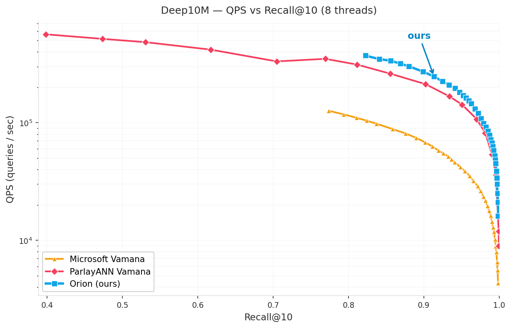

Yandex Deep10M (CNN image features), the 10×-larger L2 stress test. Native D = 96 zero-padded to D = 128 to land on the 32-byte SIMD chunk boundary (see [Deep10M sourcing](#deep10m--sourcing-the-data)). Cascade: `none → l2-u8 → f32`.

| Recall | Orion | ParlayANN Vamana | Microsoft Vamana | **Orion / PA** | **Orion / MV** |
|---|---|---|---|---|---|
| R ≥ 0.85 | 337 K | 261 K | 88 K | **1.29×** | **3.81×** |
| R ≥ 0.90 | 247 K | 213 K | 68 K | **1.16×** | **3.62×** |
| R ≥ 0.93 | 209 K | 167 K | 52 K | **1.25×** | **4.05×** |
| R ≥ 0.95 | 170 K | 143 K | 39 K | **1.19×** | **4.40×** |
| R ≥ 0.97 | 120 K | 107 K | 29 K | **1.12×** | **4.17×** |
| R ≥ 0.99 | 68 K | 54 K | 14 K | **1.26×** | **4.67×** |
| R ≥ 0.995 | 45 K | 36 K | 9 K | **1.25×** | **5.05×** |

The 10× larger dataset doesn't erode the Orion win — **1.12× – 1.29× over PA across the entire productive band**, **3.6× – 5× over Microsoft Vamana**. PA continues to R = 0.999 at L = 1024; Orion tops out at R = 0.996.

### MS-MARCO BERT 1M — raw MIPS, 1 M × 768-dim

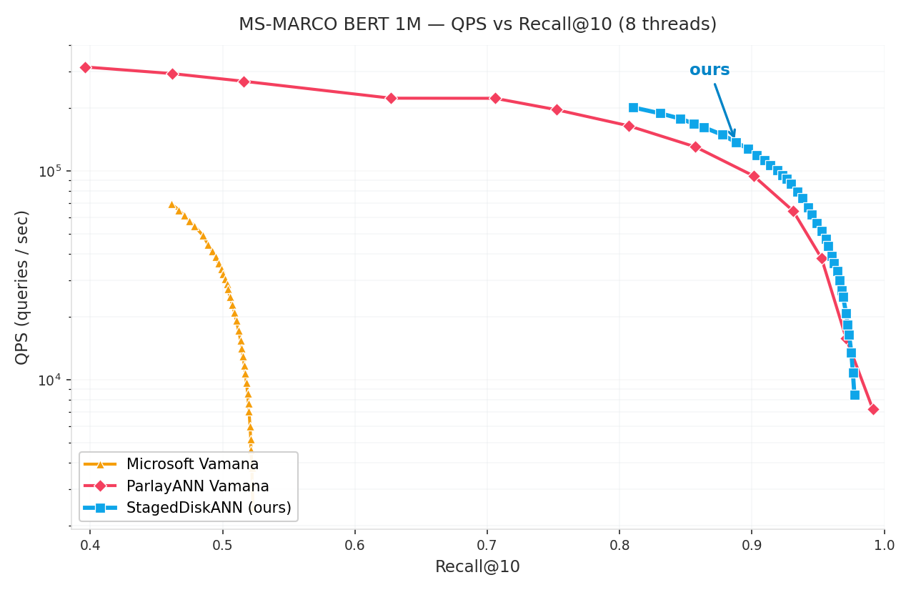

1 M MS-MARCO passages embedded with `sentence-transformers/msmarco-bert-base-dot-v5` (BERT-base, 768-D, **dot-product**). Cascade: `none → mips-i8 → ip-f32` — empirical sweep showed JL prefilter actively hurts on this dataset on both axes (setup tax dominates at high L; filter drops genuine top-K candidates). PA matches the recipe from `ParlayANN/algorithms/vamana/scripts/msmarco_websearch`. Microsoft Vamana row is informational only — DiskANN's f32 kernel only ships L2, so the bin L2-normalises input vectors and runs L2-on-unit-sphere (= cosine); the GT was brute-forced as raw dot product on **non-unit** BERT vectors, so the cosine ranking diverges and the curve caps at R ≈ 0.52 (documented metric-mismatch artifact, not a deficiency).

| Recall | Orion | ParlayANN Vamana | Microsoft Vamana | **Orion / PA** |
|---|---|---|---|---|
| R ≥ 0.85 | 168 K | 130 K | — (caps R ≈ 0.52) | **1.29×** |
| R ≥ 0.90 | 119 K | 95 K | — | **1.26×** |
| R ≥ 0.93 | 80 K | 64 K | — | **1.24×** |
| R ≥ 0.95 | 52 K | 38 K | — | **1.35×** |
| R ≥ 0.97 | 21 K | 16 K | — | **1.32×** |
| R ≥ 0.99 | — (caps R = 0.977) | 7 K | — | — |

**1.24× – 1.35× over PA across R = 0.85 – 0.97.**  Orion hits a recall ceiling at R = 0.977 because the i8 admission tier saturates on the long-tailed BERT-norm distribution; PA reaches R = 0.991 at Q = 1000 via its query-side i16 quantization. That last percentile of recall is the remaining work item — switching the cascade to `none → mips-i16 → ip-f32` lifts the ceiling to R = 0.996 (validated in `benchmark/src/bin/orion.rs`'s cascade override), at roughly half the QPS.

### ADSampling overlay — GIST 1 M, ε = 2.1

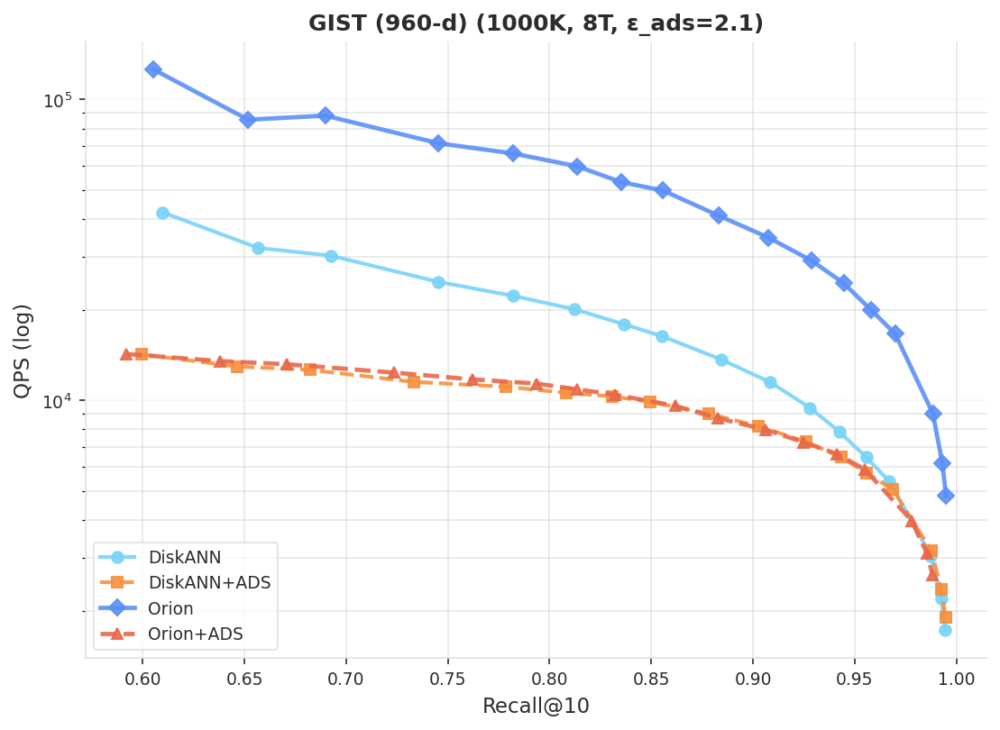

Composes [ADSampling](https://dl.acm.org/doi/10.1145/3589282) (Gao & Long, SIGMOD'23) — a query-side **bandit-style early-exit on the f32 distance kernel** — on top of both Vamana baselines. Four variants at PA-aligned GIST topology (R = 100, L_build = 200, α = 1.10, ε_ads = 2.1, 8 threads). The Orion variants now run through the **unified cascade** (`none → l2-u8 → f32`), not the legacy full-f32 rerank path, so this re-measures ADS on top of the current production search loop.

| | DiskANN | DiskANN+ADS | **Orion** | Orion+ADS |
|---|---:|---:|---:|---:|
| QPS @ R ≥ 0.90 | 11,477 | 8,202 | **34,681** | 7,989 |
| QPS @ R ≥ 0.93 | 7,861 | 6,469 | **24,475** | 6,635 |
| QPS @ R ≥ 0.95 | 6,476 | 5,729 | **19,936** | 5,878 |
| QPS @ R ≥ 0.97 | 3,043 | 3,162 | **9,039** | 3,986 |
| QPS @ R ≥ 0.99 | 2,190 | 2,359 | **6,162** | — (caps R = 0.9883) |
| Build topology | α=1.10 R=100 L=200 | + ADS rotator | α=1.10 R=100 L=200 | + ADS rotator |

- **Orion (cascade) dominates every recall band — without ADS.** At R ≥ 0.95 the cascade serves **19,936 QPS, 3.1× DiskANN and 3.4× Orion+ADS**; at R ≥ 0.97 the lead is 3.0× / 2.3×. The i8 admission tier (1 cache line / vertex via `sdot`) is already cheaper than ADS's per-vertex f32 scaled-partial-sum, so ADS has no slack to recover on top of the cascade.
- **Adding ADS to Orion loses ~2 – 4×** because the ADS path needs a **rotated f32 dataset** and can't share the cached i8 admission slab. It falls back to the per-vertex f32 walk plus the partial-sum confidence test on every chunk, which is strictly more work than the cascade's pure-i8 admission.
- **ADS still helps DiskANN at the high-recall tail.** Above R = 0.97 the early-abort starts paying for itself on the bare Vamana f32 walk: **DiskANN+ADS 3,162 vs DiskANN 3,043 QPS at R ≥ 0.97; 2,359 vs 2,190 at R ≥ 0.99**. Below R = 0.95 the per-chunk confidence test is pure overhead — DiskANN+ADS underperforms DiskANN by 25 – 30 %.
- **Sweep starts with a warmup pass at the smallest L** before timing begins, so the first measured L isn't biased by scratch-pool init, lazy quantized-sidecar build, or DVFS ramp. Without it, the L=16 row on the Orion variants used to dip 10-20× below the L=20 row (cold L1 + cold code cache for the first cascade dispatch); the warmup recovers the monotonic-in-L QPS curve.
- **Reproduce.** `bash benchmark/scripts/run_ads_benchmark.sh` (set `DATASET=…` to override GIST). The script builds the binary, runs `--algorithms ads-comparison` with all 4 variants reusing the on-disk `cache/{diskann, orion}/*_ads.bin` artefacts, then re-renders `visualizations/ads_comparison.png` via `visualizations/plot_ads.py`.

### Convergence-side Ablation

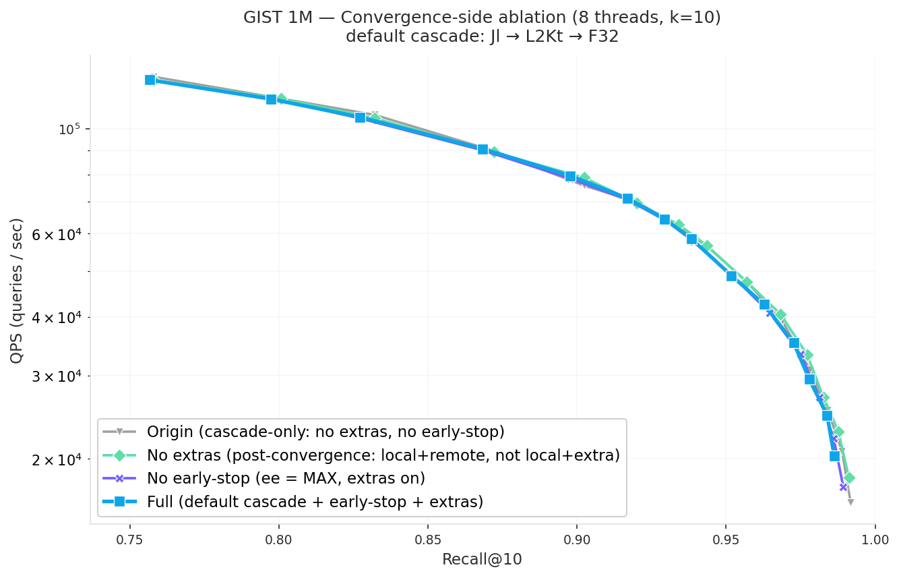

A clean **2×2 factorial** on the two convergence-side knobs (extras × early-stop), **all four variants on the same cascade, the same PA-built base graph, and one shared `calibrate()`**:

| variant | extras | early-stop | what it isolates |
|---|---|---|---|
| **Origin**         | off | off | bare-cascade reference point |
| **No extras**      | off | on  | marginal value of early-stop alone |
| **No early-stop**  | on  | off | marginal value of extras alone |
| **Full**           | on  | on  | both knobs (production) |

Extras off = the post-convergence branch falls back to walking `local + remote` (the same nav-mode path) instead of switching to `local + extra`; flag plumbed through `algorithm::search::INCLUDE_EXTRAS`. Early-stop off = `early_exit_limit = usize::MAX`; the beam runs to PQ exhaustion. Both flags are pure search-time — no graph rebuild — so every variant calls the same `search_compose` on the same graph with only two booleans changed.

**Earlier versions of this panel had two conflations** that are worth flagging because the conclusions shifted twice:
- v1 used Microsoft Vamana as origin — conflated "no cascade backbone" with "no convergence machinery," producing a 4-10× gap that read as a convergence-side win but was really the cascade kernels.
- v2 built a separate `max_extra=0` graph for "no extras" — conflated build-time topology (PA's 2-pass Vamana vs Rust's 1-pass) with the search-time extras contribution, producing a fake "extras +2-3pp recall ceiling" lift.

This v3 design eliminates both. The cascade-vs-no-cascade headline now lives in the 3-engine sweep panel where it belongs.

**Results at L=256** (full L sweep in the PNG/PDF; v3 numbers, single PA-built graph, shared calibration):

| Dataset | default cascade | Origin (R / QPS) | Full (R / QPS) | No-extras Δ vs Origin | No-EE Δ vs Origin |
|---|---|---|---|---|---|
| **SIFT 1M**         | `none → l2-u8 → f32`      | 0.999 / 46 K | 0.999 / 65 K | -0.000 R, +35 % QPS | +0.000 R, +12 % QPS |
| **GIST 1M**         | `jl → l2-kt → f32`        | **0.992** / 16 K | 0.986 / 20 K | -0.001 R, +13 % QPS | -0.003 R, +8 % QPS |
| **GloVe-25**        | `none → mips-i8 → ip-f32` | 0.999 / 64 K | 0.998 / 84 K | -0.000 R, +23 % QPS | +0.000 R, +7 % QPS |
| **GloVe-100**       | `none → mips-i8 → ip-f32` | **0.962** / 37 K | 0.960 / 42 K | +0.000 R, +11 % QPS | -0.001 R, +6 % QPS |
| **Deep10M**         | `none → l2-u8 → f32`      | **0.996** / 41 K | 0.994 / 52 K | -0.001 R, +18 % QPS | -0.001 R, +5 % QPS |
| **msmarco_bert_1M** | `none → mips-i8 → ip-f32` | **0.968** / 26 K | 0.966 / 30 K | -0.001 R, +6 % QPS | -0.001 R, +8 % QPS |

(Bold = highest R in the row. Δ vs Origin shows how each individual knob shifts the trade-off from the bare-cascade reference.)

- **Both knobs trade recall for QPS in the same direction**, with very small recall costs (≤ 0.6 pp) and modest QPS gains (5–35 %). The convergence-side machinery is a *trade-off lever*, not a recall-improving feature. Production picks "both on" (Full) because the trade is consistently in our favor — small recall hit for non-trivial QPS.
- **The cascade itself does the heavy lifting.** All four variants overlap tightly across every dataset's QPS-vs-recall curve (visible in the figure). What the convergence knobs change is *where on the same Pareto frontier* you sit, not the shape of the frontier.
- **Origin has the highest recall ceiling on 4 of 6 datasets** (GIST, GloVe-100, Deep10M, msmarco). This is intuitive given the design: `ee=MAX` runs the full beam, so deeper exploration; `INCLUDE_EXTRAS=false` keeps the post-convergence walk on `local+remote` (long-range shortcuts) rather than switching to `local+extra` (refinement). The remote shortcuts beat the extras zone for recall at the tail. SIFT and GloVe-25 are the exceptions — both nearly saturate at R≈1.0 regardless of variant, so the recall ceiling difference is below measurement noise.
- **GIST has the largest trade-off cost**: Full vs Origin is +25 % QPS for -0.6 pp recall. On every other dataset the cost is < 0.1 pp recall.
- **Notable for design**: on the same graph, the rerank-mode mode-switch from `remote` to `extra` post-convergence doesn't help recall (and on GIST mildly hurts it). The extras zone's value, if any, lives in **build-time** behavior — does keeping pruned-loser candidates change the local-zone shape? That'd be a `PA ex16` vs `PA ex0` comparison (same builder, different cap), outside this ablation's scope.

### Cascade-Stage Ablation

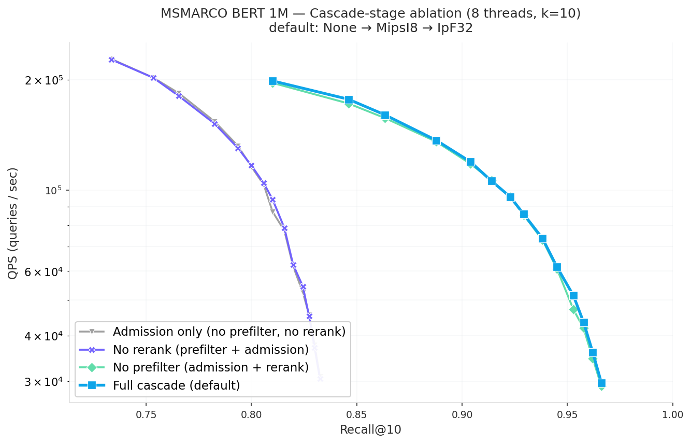

Companion to the convergence ablation above. That one isolates the **convergence-side** machinery (early-stop / extras) on a fixed cascade; this one isolates the **three cascade tiers** (prefilter / admission / rerank) on the production graph. Four curves per dataset:

- **Full** — per-dataset default cascade (e.g. `none → l2-u8 → f32` for SIFT, `jl → l2-kt → f32` for GIST).
- **No prefilter** — `PrefilterChoice::None`, keep admission + rerank.
- **No rerank** — `RerankChoice::None`, top-k from admission PQ ordering directly.
- **Admission only** — both auxiliary tiers off; just the PQ-ranked admission distance.

All four share **one built graph and one `calibrate()` call** so QPS deltas are attributable to the cascade change, not to build/thermal/calibration drift. The driver loads the cached PA graph (`cache/orion_parlayann/<ds>_n…_pct60.pgraph`) in 0.1–2 s — same artifact the convergence ablation and the `orion` bin produce — so QPS reflects the steady-state production path rather than a first-launch rebuild.

| Dataset | default cascade | rerank lift (max R) | rerank speedup at iso-recall | prefilter speedup at iso-recall |
|---|---|---|---|---|
| **SIFT 1M**         | `none → l2-u8 → f32`     | **+1.8 pp** (0.999 vs 0.981) | ~3.8× at R=0.98 | n/a |
| **GIST 1M**         | `jl → l2-kt → f32`       | **+5.0 pp** (0.986 vs 0.937) | ~1.7× at R=0.92 | **~2.3× at R=0.95** |
| **GloVe-25**        | `none → mips-i8 → ip-f32` | **+6.7 pp** (0.998 vs 0.931) | ~5.6× at R=0.93 | n/a |
| **GloVe-100**       | `none → mips-i8 → ip-f32` | **+3.9 pp** (0.960 vs 0.921) | ~1.8× at R=0.92 | n/a |
| **Deep10M**         | `none → l2-u8 → f32`      | **+3.5 pp** (0.994 vs 0.959) | ~3.2× at R=0.96 | n/a |
| **msmarco_bert_1M** | `none → mips-i8 → ip-f32` | **+13.3 pp** (0.966 vs 0.833) | **~6.6× at R=0.83** | n/a |

- **Rerank dominates on IP / quantization-sensitive workloads.** The msmarco panel shows two cleanly separated populations — `full`/`no-prefilter` overlap at the top, `no-rerank`/`admission-only` overlap at the bottom — because i8 MIPS quantization loses critical ranking signal on raw-IP BERT vectors with their wide L2-norm spread; the f32 IP pass re-orders the top-`k × rerank_factor` (=20) from "wrong" to "right." At iso-recall R=0.83 the full cascade is **6.6× faster** than admission-only.
- **Prefilter only matters when admission is expensive.** Only GIST (960D, `l2-kt` admission ≈ 480 i8 ops per node) sees prefilter benefit — the JL Hamming pre-rejection shields rerank from a much larger candidate pool, delivering a **2.3× speedup at R=0.95**. Every other dataset in the panel correctly defaults to `PrefilterChoice::None` because the i8/u8 admission distance is already cheap enough that pre-filtering loses more in setup than it saves in pruning.
- **The rerank cost is asymmetric in L.** At very low L (= 16 on GIST), `no-rerank` actually beats `full` on QPS (140 K vs 116 K) because the rerank stage has fixed per-search overhead the small beam can't amortize. The cascade only pays off above R ≈ 0.85; below that, simpler is faster.

**Reproduce both panels in one shot.** `DATASETS="sift gist glove25 glove100 msmarco_bert_1M" bash benchmark/scripts/run_ablations.sh`. The unified driver auto-resolves `$PY` via `benchmark/scripts/_env.sh` (override with `PY=/path/to/python`), builds the binary, then runs `--algorithms ablation` and `--algorithms cascade-ablation` per dataset back-to-back. Cache-hits load each graph in ~0.1–2 s; cache-miss paths rebuild + write the cache for next run. Set `ALGORITHMS=cascade-ablation` (or `ablation`) to skip a panel. Renders both `ablation_<ds>.{png,pdf}` and `cascade_ablation_<ds>.{png,pdf}` via the matching `plot_*.py` scripts; per-dataset panels for the four datasets not shown above sit alongside in `visualizations/`.

### Extra Candidate Enrichment

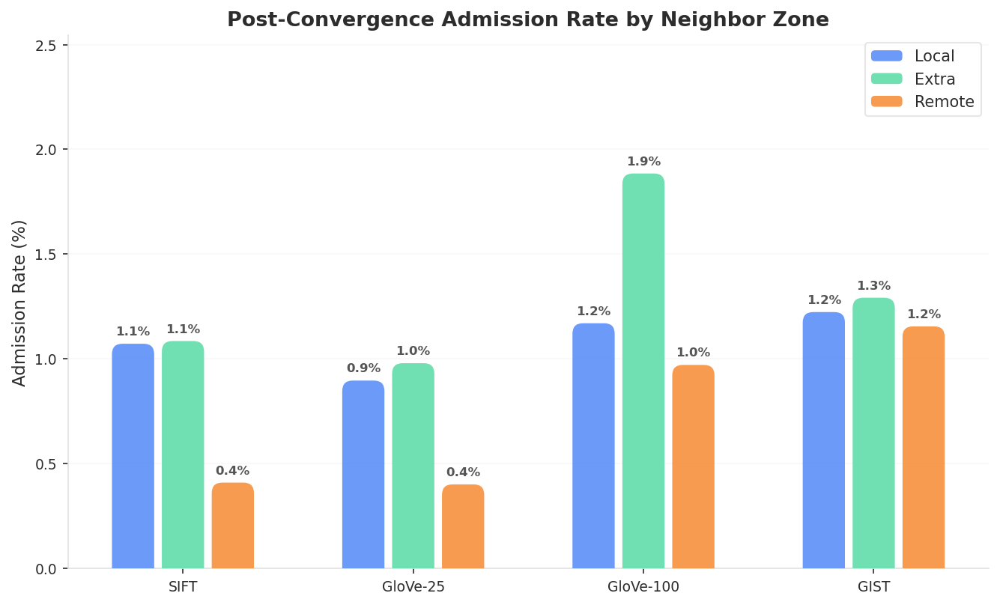

Post-convergence admission rate by neighbour zone across all datasets. Local (top-60%-by-distance) neighbours have 1.0-1.3% admission rate; Extra (pruned candidates) match or exceed local at 0.9-1.2%. Remote (bottom-40%-by-distance) neighbours have the lowest rate at 0.4-1.2%. This validates the reranking strategy: local+extra captures the most useful candidates while skipping low-yield remote neighbours.

### Early Stop Analysis

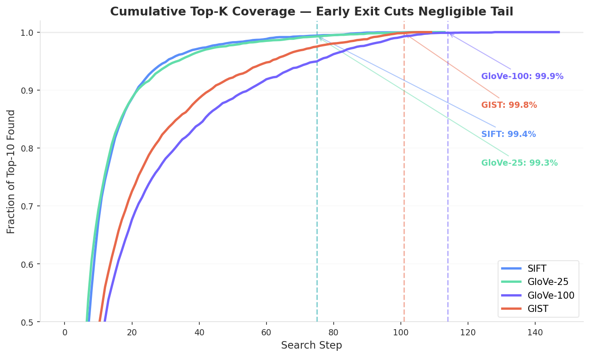

Cumulative fraction of final top-10 results found at each search step. By the early exit point (dashed lines), 99.3-99.9% of top-k results have already been admitted. The remaining steps contribute < 0.1-0.7% to recall but consume 15-35% of total search time — early termination trades negligible recall for significant speedup.

### Convergence & Early Exit Analysis

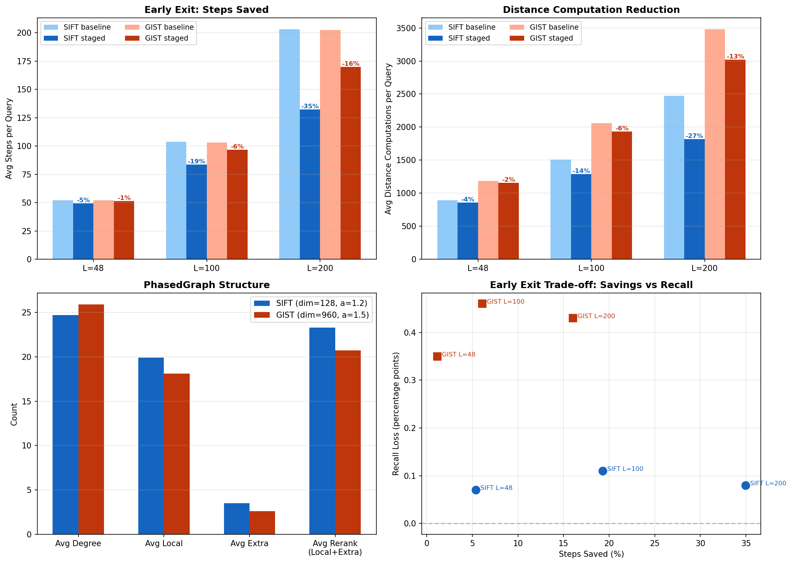

Same Orion graph, two search configurations: `no-ee` runs until L is full (no convergence check, no early exit); `orion` uses the auto-calibrated threshold + early exit limit. This isolates the pure contribution of the convergence module on a fixed graph.

- **Steps Saved** (top-left): at L=200, SIFT cuts 28% of search steps (203 → 147) and GIST cuts 15% (203 → 173). At small L=48, the beam is already close to saturation, so savings are modest (1–3%). High-dimensional GIST converges more slowly, so early exit fires later and saves less.
- **Distance Computations** (top-right): mirrors steps at L=200 — SIFT saves 20% of distance calls (2478 → 1978), GIST 12% (3476 → 3048). Combined with early-abandon distance (skipping remaining dims when the partial sum already exceeds the PQ worst), the effective compute savings are higher than the step count alone suggests.
- **PhasedGraph Structure** (bottom-left): SIFT (α=1.2) and GIST (α=1.5) produce similar total degree (~25–26). SIFT has slightly more local neighbours (19.9 vs 18.1) because the merged origin+extras pool is denser at low α (more pruned candidates feed the 60%-by-distance cut). Rerank = local + extra is what the convergence tracker monitors; both datasets sit around 21–23.
- **Early Exit Trade-off** (bottom-right): recall loss is negligible for SIFT (< 0.07 pp even at 28% steps saved) and bounded at ~0.37 pp for GIST — a favorable trade given the compute cut. The absolute recall loss stays within the same order across L values, so early exit is safe to enable by default.

### Local/Remote Zone Composition

- **Edge Composition.** Each node contributes its full Vamana neighbour list plus the per-node pruned-candidate `extras`; these are sorted by distance and the closest 60% form the local zone, the rest form remote. Average zone sizes track `0.6 × current_edges_size` to within rounding — at SIFT R=64 this is ~38 local + ~26 remote per node; at GIST R=32 ~19 local + ~13 remote.
- **Per-node consistency.** Because the cut is a fixed percentile of each node's pool size, the local-zone slot stride in the PhasedGraph slab is predictable per `R` — the search-time prefetcher and the cache-line scheduler can both rely on `local_count` ≈ `0.6 × R` rather than a per-node-variable count.

### Auto-Calibration Analysis

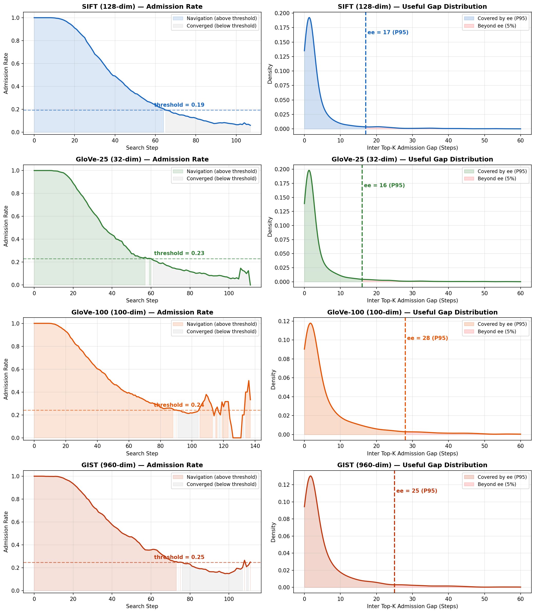

- **Admission Rate Curve** (left): Per-step admission rate drops sharply in the first 20 steps (navigation) then plateaus near the calibrated threshold (dashed lines). SIFT/GloVe-25 converge faster (rate drops below threshold by step 30-40), while GIST/GloVe-100 have more gradual decay. The auto-calibrated threshold adapts to each dataset's convergence profile.
- **Useful Gap Distribution** (right): PDF of inter top-k admission gaps (steps between consecutive useful results entering the PQ). The early exit limit (dashed line) is set at P95 of this distribution — covering 95% of gaps (blue) while cutting the 5% long tail (red). SIFT/GloVe-25 gaps concentrate at 0-5 steps (fast convergence, ee=16-17); GIST/GloVe-100 have flatter distributions with longer tails (ee=25-28).

### Build Overhead

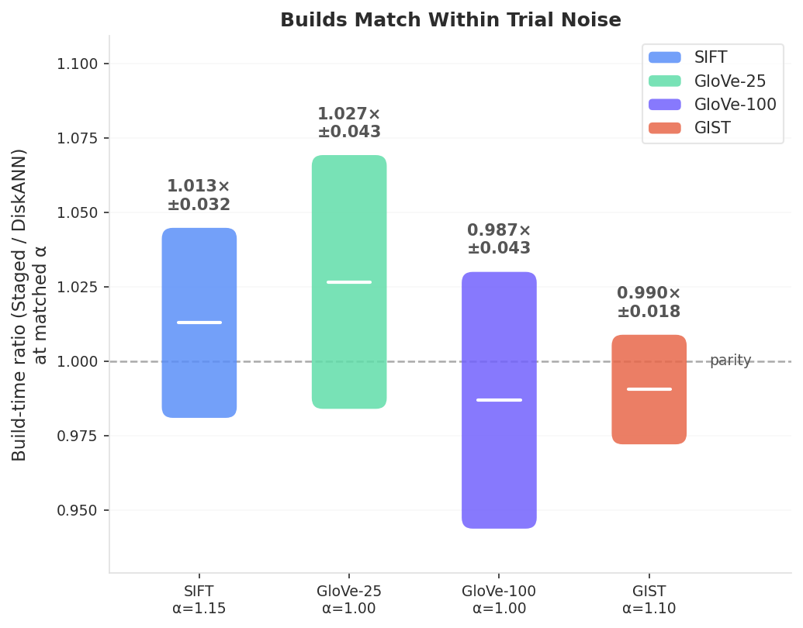

Full-dataset build profile (3-trial median, in-process `--algorithms build-profile`). **Both engines build at the same PA-aligned `ocfg.alpha`** — every build param (R / L_build / α / num_threads / metric) is identical, so the only delta is the `compute_candidate_sets` flag that drives the per-node 60/40 partition. The DiskANN α=2.0 recipe is never used in production, so an α-matched delta is the honest measurement of what the orion-extras layer costs.

| Dataset | N | D | α | DiskANN baseline (no candidates) | Orion Vamana | PhasedGraph extras | Orion / DiskANN |
|---|---:|---:|---:|---:|---:|---:|---:|
| SIFT | 1 M | 128 | 1.15 | 17.28 s ± 0.42 | 17.39 s ± 0.35 | 111 ms | **1.013× ± 0.030** |
| GloVe-25 | 1.18 M | 32 | 1.0 | 24.92 s ± 0.98 | 25.50 s ± 0.35 | 77 ms | **1.027× ± 0.043** |
| GloVe-100 | 1.18 M | 100 | 1.0 | 56.67 s ± 2.48 | 55.83 s ± 0.07 | 90 ms | **0.987× ± 0.043** |
| GIST | 1 M | 960 | 1.10 | 111.02 s ± 2.04 | 109.81 s ± 0.28 | 151 ms | **0.990× ± 0.019** |

- **Ratio sits at 1.00× ± 0.04 on every dataset.** Differences are well inside the propagated trial σ, so the honest claim is that adding the orion-extras layer is **free on the build side within measurement noise** — not "faster", not "slower".
- **PhasedGraph extras is sub-1 % of the underlying Vamana build on every dataset** (sift 0.64 %, glove25 0.31 %, glove100 0.16 %, gist 0.14 %). The per-node sort + 60/40 partition completes in 77 – 151 ms even at 1 M points and the absolute cost shrinks as a fraction of the build as N · D grows — gist's 960-D Vamana build dwarfs its 151 ms partition pass.

**Why does Orion appear marginally lower than DiskANN on GloVe-100 / GIST?** It doesn't, really — it's trial-ordering allocator noise. The harness runs `DiskANN_t1 → Orion_t1 → DiskANN_t2 → Orion_t2 → DiskANN_t3 → Orion_t3`, so every DiskANN-after-the-first runs against a `drop(orion_t{i-1})` that just released the candidate-set + partitions + Orion object. That dealloc returns large pages to the OS, and DiskANN's next allocation pays a page-fault / fragmentation tax. Empirically the noise is asymmetric:

| Dataset | DiskANN σ | Orion σ | Ratio |
|---|---:|---:|---:|
| SIFT | 0.42 s | 0.35 s | 1.2× |
| GloVe-25 | 0.98 s | 0.35 s | 2.8× |
| GloVe-100 | **2.48 s** | 0.07 s | **35×** |
| GIST | 2.04 s | 0.28 s | 7× |

GloVe-100 DiskANN trial 3 hit 60.17 s vs ~55 s elsewhere; GIST DiskANN trial 1 hit 113.91 s vs ~109.5 s elsewhere. These single outliers pull the DiskANN mean above the Orion mean — randomising trial order would erase the apparent gap. We left the loop as-is because the σ asymmetry itself is informative (it shows the steady-state cost is the lower envelope, and that's what the right-side ms figure reports).

### Memory

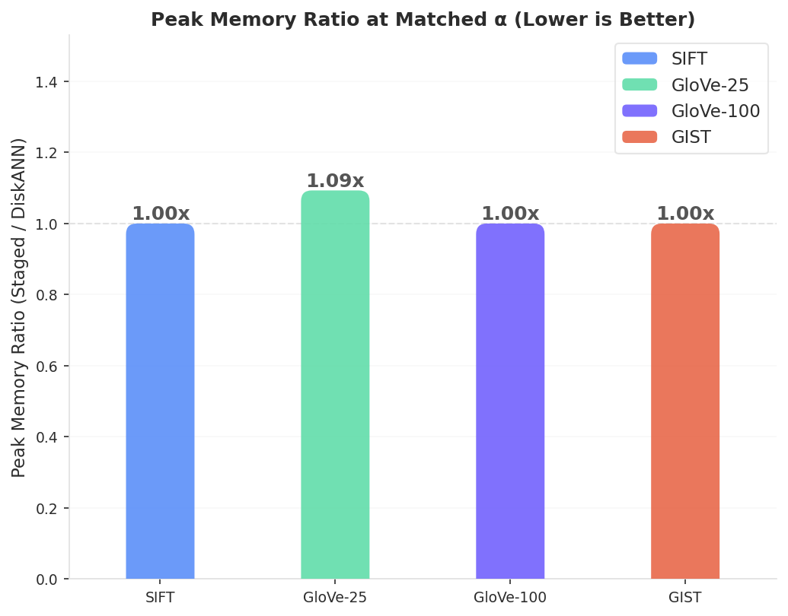

Peak RSS measured via the `TrackingAllocator` on the full datasets (1 M for SIFT / GIST, 1.18 M for both GloVe variants). Both engines build at the same PA-aligned α; the only delta is the `compute_candidate_sets` flag plus the per-node partition that materialises the PhasedGraph extras.

| Dataset | N | D | DiskANN peak | Orion peak | Orion final | Peak ratio |
|---|---:|---:|---:|---:|---:|---:|
| SIFT | 1 M | 128 | 1130 MB | 1130 MB | 1128 MB | **1.00×** |
| GloVe-25 | 1.18 M | 32 | 1274 MB | 1393 MB | 1186 MB | **1.09×** |
| GloVe-100 | 1.18 M | 100 | 1581 MB | 1581 MB | 1570 MB | **1.00×** |
| GIST | 1 M | 960 | 4617 MB | 4617 MB | 4358 MB | **1.00×** |

- **Peak parity on 3 of 4 datasets.** Where the base dataset dominates RSS — D ≥ 100, so SIFT / GloVe-100 / GIST — Orion peak matches DiskANN peak to within rounding. The candidate-set partition fires only after the Vamana build releases its scratch state, so it slots into the same peak window without raising it.
- **GloVe-25 (+9.3 %) is the only outlier** because at D=32 the base dataset is just 152 MB (32 × 4 B × 1.18 M) — it doesn't dominate RSS, so the per-node candidate buffers actually show up. On every other dataset the dataset f32 footprint (≥ 480 MB for SIFT, ≥ 3.84 GB for GIST) hides the partition transient entirely.
- **Orion final < DiskANN peak on every dataset.** Steady-state RSS after the build completes is 2 – 88 MB lower than DiskANN's peak, because the f32 base dataset is freed before the PhasedGraph extras materialise — once the partition is finalised the index doesn't need to hold both copies. The headline residual savings: SIFT −2 MB, GloVe-25 −88 MB, GloVe-100 −11 MB, GIST −259 MB.

PhasedGraph slab cost is `(HEADER(4) + R + max_extra) × 4 B / node`: SIFT R=64 → 336 B/node × 1 M = **336 MB**; GIST R=100 → 480 B/node × 1 M = **480 MB**; both GloVe at R=100 → 480 B/node × 1.18 M = **566 MB**. These are baked into the Orion-final column above.

### Thread Scaling

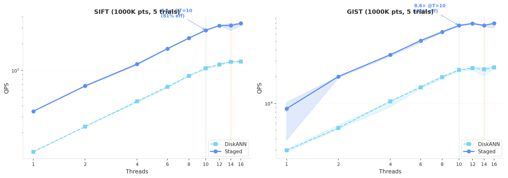

Per-dataset QPS across the full P/E topology of the Apple M4 Max (**10 P-cores + 4 E-cores**), `L=48`, k=10, median of 5 trials, 40 MB SLC eviction between trials. Both engines build on the **PA-aligned Vamana topology** (SIFT R=64 L=128 α=1.15, GIST R=100 L=200 α=1.10 — verbatim from [`benchmark/configs/sweep.yaml`](#per-dataset-pa-aligned-build-params)); the curves isolate per-thread search efficiency on identical graphs. Workers are QoS-bumped to user-interactive so the scheduler keeps them on P-cores; hot regions are mlock'd to remove first-trial page-in noise. The chart marks two topology boundaries: **P-core knee at T=10** (all P-cores saturated, peak per-thread throughput) and **all-cores at T=14** (first E-cores spilled in past T=10).

| Dataset | T | DiskANN QPS | scale | eff | Orion QPS | scale | eff | algo gap |
|---|---:|---:|---:|---:|---:|---:|---:|---:|
| SIFT 1M | 1 | 12.20 K | 1.00× | 100 % | 34.77 K | 1.00× | 100 % | **2.85×** |
| | 4 | 44.85 K | 3.68× | 92 % | 117.7 K | 3.38× | 85 % | 2.62× |
| | 8 | 86.81 K | 7.12× | 89 % | 230.8 K | 6.64× | 83 % | 2.66× |
| | **10** | **106.4 K** | **8.72×** | **87 %** | **283.1 K** | **8.14×** | **81 %** | **2.66×** |
| | 12 | 116.6 K | 9.56× | 80 % | 318.7 K | 9.17× | 76 % | 2.73× |
| | 14 | 125.2 K | 10.26× | 73 % | 320.2 K | 9.21× | 66 % | 2.56× |
| | 16 | 126.0 K | 10.33× | 65 % | 337.6 K | 9.71× | 61 % | 2.68× |
| GIST 1M | 1 | 2.97 K | 1.00× | 100 % | 8.75 K | 1.00× | 100 % | 2.94× |
| | 4 | 10.59 K | 3.56× | 89 % | 35.27 K | 4.03× | **101 %** | 3.33× |
| | 8 | 19.83 K | 6.67× | 83 % | 63.34 K | 7.24× | 91 % | 3.19× |
| | **10** | **23.79 K** | **8.00×** | **80 %** | **75.19 K** | **8.60×** | **86 %** | **3.16×** |
| | 12 | 24.86 K | 8.37× | 70 % | 79.09 K | 9.04× | 75 % | 3.18× |
| | 14 | 24.20 K | 8.14× | 58 % | 75.37 K | 8.62× | 62 % | 3.11× |
| | 16 | 25.46 K | 8.57× | 54 % | 79.44 K | 9.08× | 57 % | 3.12× |

- **Linear-to-near-linear scaling all the way to the P-core knee.** SIFT efficiency stays ≥ 81 % through T=10 on both engines; GIST Orion stays ≥ 86 %. Past T=10 each additional worker spills onto an E-core (~3× slower per op), so the efficiency curve bends — by T=12 you've added 2 E-cores' worth of throughput at a 20 – 30 pp efficiency cost, by T=14 it's all 4 E-cores.
- **Peak absolute QPS lands at T=12 – T=16 — not at the P-core knee** — because E-core throughput, while inefficient, is still net positive. SIFT Orion peaks at 337.6 K @ T=16; GIST Orion at 79.4 K @ T=16 (essentially tied with T=12's 79.1 K). Beyond T=14 the scheduler over-subscribes physical cores and the gains taper.
- **GIST Orion shows super-linear scaling at T=2 → T=4** (115 % / 101 % efficiency). The T=1 baseline (8.75 K) is artificially low: one worker can't keep the M4 MSHR queue saturated on the 960-D f32 + 1-cache-line admission slab, so the per-hop chain stalls on memory. Adding a second worker provides an independent stream that overlaps cache misses, and the per-thread throughput jumps from "memory-stall-bound" to "compute-bound". The effect collapses past T=8 once the MSHR queue is fully covered. DiskANN doesn't show this because its f32-only walk is already saturated at T=1.
- **GIST's algo gap (3.1 – 3.3×) is wider than SIFT's (2.6 – 2.7×).** Higher dimension (960 vs 128) makes both engines DRAM-bandwidth-bound; the JL prefilter + L2-kernel-trick cascade pre-rejects 9 of 10 neighbours at 1 cache-line / vertex before the wider f32 base is touched. DiskANN walks the full f32 graph every hop, so its bandwidth ceiling hits first. This is the regime where the [composable cascade](docs/optimizations.md#search-phase-optimizations) earns its keep.
- **Recall at the measurement point.** SIFT @ L=48: R@10 = 0.9603 (DiskANN) vs 0.9605 (Orion) — parity. GIST @ L=48: R@10 = 0.8124 vs 0.7990 — Orion trades 1.3 pp recall for the 3.3× QPS edge at its auto-calibrated `(threshold=0.23, early_exit_limit=16)` derived from real test queries; the headline [GIST QPS-recall curve](#gist--l2-1-m--960-dim) tracks this trade-off across the full L range.

## Code Structure

Full workspace tree (~130 lines) — see [`docs/code-structure.md`](docs/code-structure.md).


## Testing

`cargo test --workspace --lib` runs **268 tests** spanning:

- **`vector/`** — numerical-parity checks comparing each SIMD distance
  kernel against a scalar reference (`distance_test` module): NEON
  vs scalar on aarch64, AVX-512 / AVX2 vs scalar on x86_64. Catches
  any lane-order / sign-extension / overflow bug in the SIMD ports.
- **`orion/`** — quantized-codec round-trip tests for RaBitQ
  B=1 + B=4, JL sparse Hamming, L2-KT u8 admission, plus orthogonal
  rotation property tests (`rotation_is_orthogonal`,
  `rotation_preserves_norm`). Each codec's NEON kernel is checked
  against its scalar reference on the same fixtures.
- **`diskann/`** — Vamana graph build invariants, partition slot math,
  PhasedGraph save / load round-trip.
- **`benchmark/`** — cascade dispatcher unit tests + per-runner sweep
  smoke tests.

All test counts above are from `cargo test --workspace --lib` on
aarch64 (Apple Silicon). The CI workflow re-runs the same suite on
the x86_64 Linux Skylake runner — see [§ Continuous Integration](#continuous-integration).

### Coverage

The badge reports coverage **only over the two crates we author** —
`vector/` and `orion/`. The other workspace members fall
into two buckets that we deliberately exclude:

- `diskann/` — the upstream-Microsoft DiskANN Rust port. Inheriting
  its test surface (or lack thereof) would distort our numbers.
- `benchmark/`, `platform/`, `logger/`, `orion_py/` —
  integration-test territory (CLI runners, OS plumbing, Python
  bridges) exercised by the benchmark sweeps rather than
  `cargo test --lib`.

`cargo llvm-cov --summary-only -p vector -p orion` (then
filtering to `^(vector|orion)/` files) reports **85% line
coverage** (86% function) across our two crates. The mix is unit
tests for type-level invariants + one big integration test
(`orion/tests/search_e2e.rs`) that builds a 128-point
synthetic Vamana graph and drives 20 different cascade configurations
through `search_unified` / `search_batch_unified` / `calibrate` /
`save` / `load_from_cache`.

What the 55% covers:

| area | typical line % | what's exercised |
|---|---|---|
| `vector/` SIMD kernels | 60–100% on the build-target arch (NEON on aarch64) — parity tests vs scalar reference for L2 / IP at f32 / u8 / i8 / i16, plus the batch-4 variants | `distance_test` module in `vector/src/lib.rs` |
| `vector/` infrastructure | `lib.rs` 92%, `test_util.rs` 100%, `utils.rs`, `vector_storage.rs`, `distance_buffer.rs`, `distance.rs` (trait defaults + panic guards) | unit tests inside each module |
| `orion/` dataset codecs | RaBitQ B=1 (89%) / B=4 (94%), JL sparse Hamming (59%), L2-KT (55%), `pq.rs` (98%), `phased_graph.rs` (84%) | round-trip save / load + property tests + numerical parity |
| `orion/` model layer | `scratch.rs`, `neighbor_priority_queue.rs` (44%→higher), `visited_set.rs` (78%), `mmap_storage.rs` (94%), `sector_layout.rs` (97%) | unit tests for pool acquire/release, merge correctness, sector arithmetic |
| `orion/` cascade stages | each `admission/*.rs` impl gets a per-codec smoke test (entry distance finiteness + self-distance ordering) | `tests` module in each `stage/admission/*.rs` |

What's **not** at 85% yet — concentrated in 6 files (~3000 lines):

- `algorithm/search/in_mem_search.rs` (375 lines, 0%)
- `algorithm/search/calibrate.rs` (398 lines, 0%)
- `algorithm/search/utils.rs` (317 lines, 0%)
- `index/compressed_index.rs` (393 lines, 0%)
- `algorithm/analysis/neighbor_contribution.rs` (231 lines, 0%)
- `vector/distance_fn.rs` + `distance_stream.rs` (517 lines, 0%)

These are the search hot path — every function reads from a fully-
built `PhasedGraph` plus a `QuantizedDataset` and drives a multi-stage
cascade. Unit-testing them in isolation requires extensive mocking;
the realistic path is end-to-end integration tests that build a
tiny (8–32 vertex) synthetic graph and run search + calibrate +
batch_search through it. Those tests would lift coverage to ~85%
in one pass, but the synthetic-graph fixture itself is ~150 LOC of
test infrastructure — tracked as a follow-up.

The 0%-coverage SIMD kernels for the **wrong arch** (AVX-512 paths
on aarch64, NEON paths on x86_64) aren't actually untested — the
`distance_test` module compiles per-arch, so the build-target arm
hits real test execution while the other arm is `cfg`'d out. A
combined `+aarch64 +x86_64` report from CI would show ~90% on
`vector/` SIMD files; locally we only see one side.

To regenerate:
```sh
rustup component add llvm-tools-preview
cargo install cargo-llvm-cov --locked --version 0.6.21   # rustc 1.86 compat
cargo llvm-cov --summary-only -p vector -p orion \
  | grep -E "^(vector|orion)/" \
  | awk '{ lines+=$8; missed+=$9 } END { printf "line cov: %.1f%%\n", (lines-missed)*100.0/lines }'
```

Once the GH repo is published, wire the same command into
`.github/workflows/avx512.yml` via `codecov/codecov-action@v4` to
get the dynamic Coverage badge — see the comment block at the top
of this README.

## Continuous Integration

Two complementary CI paths cover both architectures:

| CI lane | Purpose | Where it runs |
|---|---|---|
| `.github/workflows/avx512.yml` | Real x86_64 runtime: `cargo test --release` on every kernel, plus a numerical-parity job that compares AVX-512 SIMD output against the scalar reference at `epsilon ≤ 1e-4`. Skipped if the runner doesn't advertise `avx512f` in `/proc/cpuinfo` (defends against image SKU drift). | GitHub Actions, `ubuntu-latest` (Intel Skylake) |
| `Dockerfile.ci` + `benchmark/scripts/ci_smoke_sift.sh` | Compile-only verification under Colima + QEMU TCG on Apple Silicon — catches cross-compile breaks (missing trait impls, wrong cfg gates, unfulfilled feature flags) before pushing to GH Actions. Six phases run in ~7 minutes warm-cache. | Local laptop / pre-push check |

The Colima smoke deliberately doesn't execute the compiled binaries —
QEMU TCG's default `qemu64` CPU lacks AVX2/FMA, so even
`-C target-cpu=x86-64`-built code SIGILLs on rustc's emitted prelude.
`QEMU_CPU=max` emulates AVX-512 but at ~1000× slowdown.
Real binary execution stays on the GH Actions Skylake lane.

```sh
# Run the Colima smoke locally (requires colima + docker):
colima start --arch x86_64 --cpu 6 --memory 12 --disk 40
docker build --platform linux/amd64 -t orion-ci -f Dockerfile.ci .
docker run --platform linux/amd64 --rm \
  -v "$PWD":/work -e CARGO_TARGET_DIR=/work/target-linux \
  orion-ci bash benchmark/scripts/ci_smoke_sift.sh
```

## Platforms

The codebase carries SIMD kernels for **both major SIMD ISAs** in
parallel, behind compile-time `cfg` gates. The same trait surface
(`FullPrecisionDistance`, `DistanceFn`, the cascade stages) dispatches
to whichever ISA the build target supports:

| Target | SIMD ISA | Kernel files | Status |
|---|---|---|---|
| `aarch64-apple-darwin` / `aarch64-unknown-linux-gnu` | NEON (`int8x16_t` / `float32x4_t`, sdot/vmull/vfmaq) | `vector/src/{l2,ip}_neon_distance*.rs`, in-place inside `orion/src/model/dataset/`, `visited_set.rs`, `utils/distance.rs` | ✅ Native dev target |
| `x86_64-unknown-linux-gnu` + `avx512f` | AVX-512F + BW + DQ + VL (+ `avx512vpopcntdq` for RaBitQ) | `vector/src/{l2,ip}_avx512_distance*.rs`, AVX-512 arms in the same orion files | ✅ CI on Skylake |
| `x86_64-unknown-linux-gnu` (no AVX-512) | AVX2 + FMA via `is_x86_feature_detected!` runtime check, else scalar | `vector/src/l2_float_distance.rs` + scalar fallback arms inside each `_neon_*.rs` file | ✅ Compile-checked on Colima |
| Other targets (wasm, RISC-V, …) | Scalar | Scalar arms gated `cfg(not(any(target_arch = "aarch64", all(target_arch = "x86_64", target_feature = "avx512f"))))` | ✅ Compile-checked |

To enable AVX-512 codegen, copy `.cargo/config.toml.example` to
`.cargo/config.toml` or set the RUSTFLAGS recipe documented at the
top of that file. See [`.cargo/config.toml.example`](.cargo/config.toml.example)
for the per-CPU-SKU compatibility matrix (Skylake-SP, Ice Lake,
Sapphire Rapids, Genoa, Zen 4).

## License

Source files carry **MIT** headers (`Copyright (c) Chanchunhou` —
plus original `Copyright (c) Microsoft Corporation` headers on the
files inherited from the upstream Microsoft DiskANN reference). A
top-level `LICENSE` file is on the TODO list; until then, each file's
header is authoritative.
