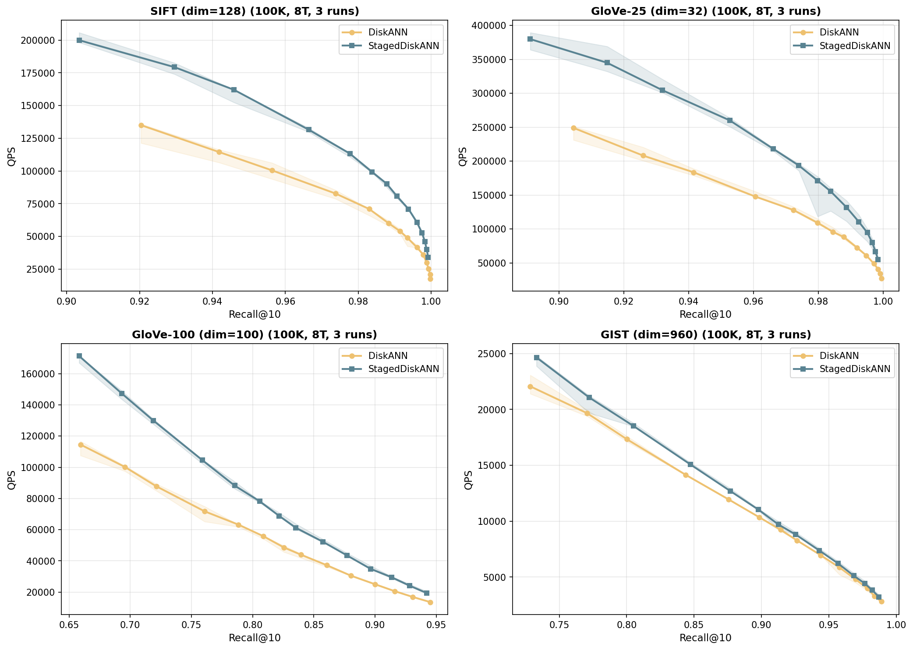
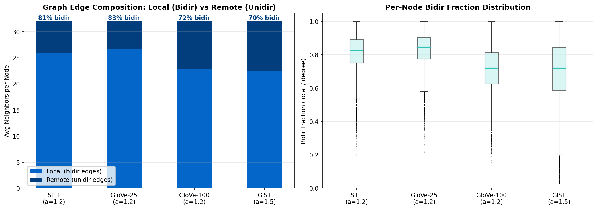

# StagedDiskANN

A two-phase graph-based approximate nearest neighbor search algorithm that accelerates DiskANN (Vamana) by adaptively switching between **navigation** (full graph traversal) and **reranking** (localized candidate refinement) during search.

## Core Idea

Standard Vamana search expands all neighbors at every step, even after the search has converged to a local region. StagedDiskANN observes that:

1. **Early in search (navigation)**: long-range "remote" neighbors are essential for escaping local minima and reaching the correct region.
2. **After convergence (reranking)**: only nearby "local" neighbors and high-quality pruned candidates contribute to improving results.

By detecting convergence and switching to a reduced candidate set, StagedDiskANN skips unnecessary distance computations while preserving recall.

## Architecture

### PhasedGraph

A cache-line aligned, concurrency-safe graph structure backed by `AlignedBoxWithSlice<u32>` with per-node reader tracking and bounded write queue (same concurrency model as DiskANN's `NodeSlabBuffer`).

Each node's neighbors are partitioned into three zones:

```
+------------------+-------------------+------------------+
| local_neighbors  | remote_neighbors  | extra_candidates |
| (navigation +    | (navigation only) | (reranking only) |
|  reranking)      |                   |                  |
+------------------+-------------------+------------------+
```

- **local**: Bidirectional graph neighbors (both u->v and v->u exist). These are "true" near neighbors confirmed by the graph structure.
- **remote**: Unidirectional neighbors (only u->v). These are long-range navigation shortcuts placed by Vamana's pruning.
- **extra**: Top-k closest pruned candidates from the Vamana build process. These are points that were spatially close but removed by alpha-occlusion pruning. Stored with distances for quality ranking.

### Bidirectional Edge Detection

The local/remote split is determined by **bidirectionality** of graph edges, not by distance thresholds or fixed fractions. This provides a semantically meaningful and data-adaptive boundary:

- In sparse graphs (alpha=1.2): bidir rate drops sharply from ~100% to ~1% across the neighbor list, creating a clear split.
- In dense graphs (alpha=2.0): bidir rate declines more gradually, automatically adjusting the local zone size.

### Admission-Based Convergence Detection

Convergence is detected by tracking the **admission rate** of candidates into the priority queue, rather than distance-based heuristics:

- A sliding window tracks what fraction of recent expansion steps produced at least one PQ admission.
- When the admission fraction drops below a threshold (default 15%), the search switches to reranking mode.
- Convergence is **reversible**: if a burst of admissions occurs, the search re-enters navigation mode.
- A minimum visit count (2x window size) prevents premature convergence.

This directly measures "is the search still making progress?" and works consistently across datasets with different distance distributions.

### Distance-Sorted Candidate Slab

During Vamana build, the occlusion pruning process records `(distance, pruned_id)` pairs in a per-node slab (mmap-backed, indexed by location node). At extract time:

1. Read `slab[node]`: all `(distance, pruned_id)` pairs from pruning events involving this node.
2. Sort by distance, dedup by ID.
3. Take top-k closest as extra candidates.

This eliminates the need for the `key_neighbor_count` parameter and anchor-based cross-lookups from the original design.

### Build-Time Distance Maintenance

Under the `staged_diskann` feature, `VertexAndNeighbors` maintains a parallel `neighbor_dists: Vec<f32>` alongside neighbor IDs. This enables:

- **Sorted insertion** in `inter_insert`: new reverse edges are inserted at the correct distance-sorted position via binary search, maintaining neighbor order throughout the build.
- **Skip P1 sort**: The post-build `sort_neighbors_by_distance_in_place` step (which recomputed ~N*degree distances) is eliminated.
- **Early dataset release**: The dataset is freed immediately after the build phase (before candidate extraction), ensuring dataset and candidate_sets never coexist in memory.

## Key Optimizations

### Memory Efficiency

| Optimization | Impact |
|---|---|
| Slab indexed by location (not anchor) | max_extra per node bounded by slab cap, not cross-query accumulation |
| `max_extra` parameter caps stride | PhasedGraph stride = `HEADER(4) + max_degree + max_extra`, cache-line aligned |
| Dataset freed before candidate extraction | Peak memory reduced by ~50 MB on 100K datasets |
| Single-pass PhasedGraph build with stack buffers | No intermediate `Vec<Vec<u32>>` allocation |
| `AlignedBoxWithSlice<u32>` slab | Cache-line aligned, zero-copy reads |

### Search Performance

| Optimization | Impact |
|---|---|
| Bidir-based local/remote split | Data-adaptive, no distance info needed at search time |
| Admission-based convergence | More accurate than distance-based, works across all dataset types |
| Reversible convergence | Prevents permanent recall loss from false convergence |
| Early exit after convergence | Stops search when consecutive steps produce no PQ admissions |
| Two-slice reranking (`local + extra`) | Smaller working set after convergence |
| Prefetch pipeline | Next node's graph slot and vector prefetched during current expansion |
| `total_cmp` comparison | Branchless integer comparison for `Neighbor::cmp`, eliminates `Option` overhead |
| 4-way NEON unroll | L2 distance processes 16 floats/iteration, halving loop branch overhead for high-dim |

### Early Exit

After convergence, the priority queue often contains many unvisited candidates that will not improve the result. The `EarlyExitChecker` tracks consecutive expansion steps with zero admissions during the converged phase. When this count exceeds the configured limit, the search terminates immediately.

This is especially effective for high-dimensional data (e.g., GIST-960) where distance computation dominates runtime — early exit directly reduces the number of expensive distance calls rather than just the number of neighbors per step.

## Configuration

StagedDiskANN uses a lower alpha than DiskANN to produce more diverse graph edges (more remote shortcuts for navigation, more pruned candidates for reranking):

```yaml
defaults:
  diskann:
    alpha: 2.0
    graph_degree: 32
    build_search_list_size: 48
  staged:
    alpha: 1.2              # more aggressive pruning = more remote shortcuts
    graph_degree: 32
    build_search_list_size: 48
    max_extra: 4
    window_size: 5

datasets:
  gist:
    dimension: 960
    staged:
      alpha: 1.5            # high-dim needs denser graph for connectivity
```

The `alpha` parameter controls the pruning aggressiveness and should be tuned per dataset:
- **Low-to-medium dim (32-128)**: `alpha=1.2` works well, producing a sparse graph with clear local/remote separation.
- **High dim (960+)**: `alpha=1.5` or higher to maintain graph connectivity.

### Auto-Calibration

Convergence parameters (`threshold`, `early_exit_limit`) are automatically derived at build time via `calibrate()`. The calibrator runs warmup queries with full-graph search (no convergence, no early exit) and analyzes:

1. **Per-step admission rate curve** — the threshold is set at the inflection point where admission rate drops sharply.
2. **Gap distribution** between consecutive useful admissions — the early exit limit is set from the P90 tail gap.

This eliminates manual tuning and adapts to dataset characteristics automatically.

## Benchmark Results

All benchmarks: 100K points, 8 threads, Recall@10 vs QPS. Convergence parameters auto-calibrated per dataset. Results are median of 3 runs with min-max confidence bands.

### QPS vs Recall@10 Curves



Shaded bands show min-max range across 3 independent runs. StagedDiskANN consistently achieves higher QPS than DiskANN at the same recall level across all four datasets.

### Same-L QPS Comparison (Median of 3 Runs)

| Dataset | Dim | L | DiskANN R@10 / QPS | Staged R@10 / QPS | Speedup |
|---|---|---|---|---|---|
| SIFT | 128 | 32 | 0.974 / 82,776 | 0.966 / 131,597 | **1.59x** |
| SIFT | 128 | 128 | 0.999 / 29,866 | 0.998 / 52,793 | **1.77x** |
| GloVe-25 | 32 | 32 | 0.961 / 147,667 | 0.953 / 259,990 | **1.76x** |
| GloVe-25 | 32 | 128 | 0.997 / 49,123 | 0.995 / 94,592 | **1.93x** |
| GloVe-100 | 100 | 32 | 0.761 / 71,779 | 0.759 / 104,611 | **1.46x** |
| GloVe-100 | 100 | 128 | 0.900 / 25,050 | 0.896 / 34,932 | **1.39x** |
| GIST | 960 | 32 | 0.844 / 14,149 | 0.847 / 15,076 | **1.07x** |
| GIST | 960 | 128 | 0.970 / 4,800 | 0.968 / 5,127 | **1.07x** |

### Speedup Summary

| Dataset | Dim | Speedup Range | Key Factor |
|---|---|---|---|
| **SIFT** | 128 | 1.5x -- 1.9x | Balanced: convergence + early exit both effective |
| **GloVe-25** | 32 | 1.6x -- 1.9x | Low-dim distance is cheap; traversal savings dominate |
| **GloVe-100** | 100 | 1.3x -- 1.5x | Moderate: distance cost partially offsets traversal savings |
| **GIST** | 960 | 1.0x -- 1.1x | Distance computation dominates (72% of time); early abandon helps at high L |

### Convergence & Early Exit Analysis


- **Early Exit: Steps Saved** (top-left): SIFT saves 35% of search steps at L=200, while GIST saves 16% — high-dimensional search converges more slowly, leaving less room for early termination.
- **Distance Computation Reduction** (top-right): Staged reduces distance calls by 27% (SIFT) vs 13% (GIST) at L=200. Combined with early abandon (skipping partial distance computation when partial sum exceeds PQ worst), the effective compute savings are higher.
- **PhasedGraph Structure** (bottom-left): Both datasets have similar average degree (~25), but SIFT has more local neighbors (19.9 vs 18.1) due to lower alpha producing more bidirectional edges. More local neighbors means more reranking-only candidates, which amplifies the convergence benefit.
- **Early Exit Trade-off** (bottom-right): Recall loss is minimal (< 0.1 percentage points for SIFT, < 0.5 for GIST) even when saving 35% of steps. The trade-off is favorable — large compute savings with negligible recall cost.

### Bidirectional Edge Analysis



- **Edge Composition** (left): StagedDiskANN classifies all bidirectional edges as local and unidirectional edges as remote. SIFT/GloVe-25 (a=1.2) have 81-83% bidir edges — the graph is strongly bidirectional, giving a large local zone for efficient reranking. GIST (a=1.5) has 70% bidir, a natural consequence of high-dimensional space requiring more long-range unidirectional shortcuts for navigation.
- **Per-Node Distribution** (right): The bidir fraction per node shows tight distributions for SIFT/GloVe-25 (most nodes have ~80% bidir edges), while GloVe-100/GIST are broader. This validates the bidirectionality-based split — it produces a consistent, data-adaptive local/remote boundary without manual tuning.

### Auto-Calibration Analysis


- **Admission Rate Curve** (left): Per-step admission rate drops sharply in the first 20 steps (navigation) then plateaus near the calibrated threshold (dashed lines). SIFT/GloVe-25 converge faster (rate drops below threshold by step 30-40), while GIST/GloVe-100 have more gradual decay. The auto-calibrated threshold adapts to each dataset's convergence profile.
- **Useful Gap Distribution** (right): PDF of inter top-k admission gaps (steps between consecutive useful results entering the PQ). The early exit limit (dashed line) is set at P95 of this distribution — covering 95% of gaps (blue) while cutting the 5% long tail (red). SIFT/GloVe-25 gaps concentrate at 0-5 steps (fast convergence, ee=16-17); GIST/GloVe-100 have flatter distributions with longer tails (ee=25-28).

### Build Overhead


- **Build Time** (left): StagedDiskANN's PhasedGraph construction overhead is < 1% of total build time across all datasets. The graph build itself is faster than DiskANN because lower alpha means less pruning work.
- **Build Speed Ratio** (right): StagedDiskANN builds 1.0x-1.6x faster than DiskANN. The search acceleration comes at **zero additional build cost** — in fact, the total build is faster.

### Memory

PhasedGraph uses a fixed stride of 48 u32 per node (cache-line aligned), totaling **18.3 MB** for 100K nodes. StagedDiskANN uses a lower alpha (sparser base graph), so total index memory is comparable to DiskANN despite the extra structure.

## Code Structure

```
staged_diskann/
  src/
    model/
      phased_graph.rs       # PhasedGraph: AlignedBoxWithSlice slab + bidir split + write queue
    algorithm/
      search/
        convergence.rs      # Admission-based convergence detector
        early_exit.rs       # Early exit after consecutive zero-admission steps
        calibrate.rs        # Auto-calibration of threshold + early exit limit
        in_mem_search.rs    # Two-phase greedy beam search with early exit
    index/
      builder.rs            # build_diskann_index: Vamana build + partition extraction
      compressed_index.rs   # StagedDiskANN: PhasedGraph construction + search entry points

diskann/
  src/
    model/graph/
      vertex_and_neighbors.rs   # Distance-sorted neighbor maintenance (add_sorted, neighbor_dists)
    algorithm/prune/
      prune.rs                  # Slab writes: (distance, pruned_id) per location
    index/inmem_index/
      inmem_index.rs            # extract_graph_and_candidates: returns (local, remote, extra) partitions
```
