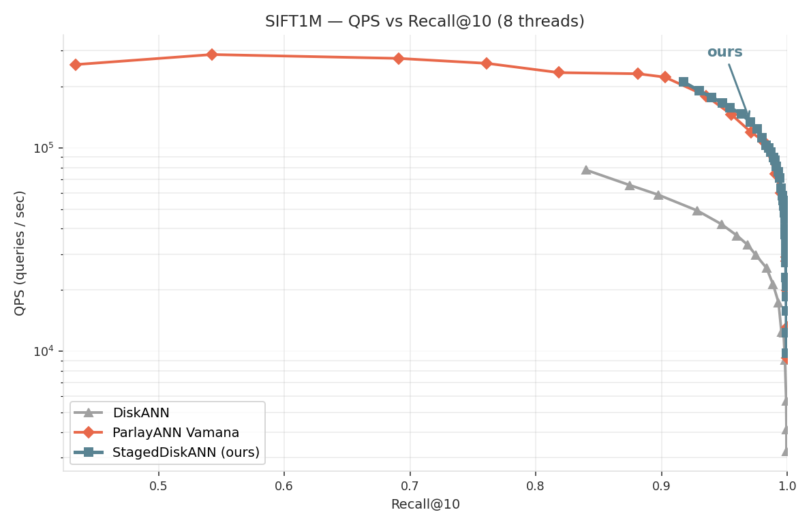
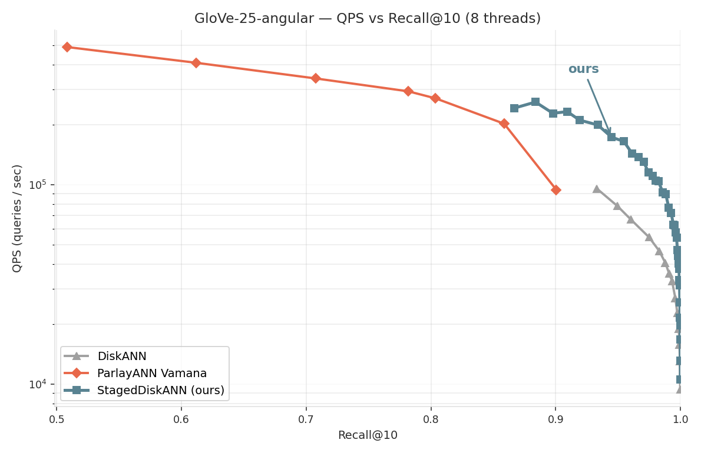
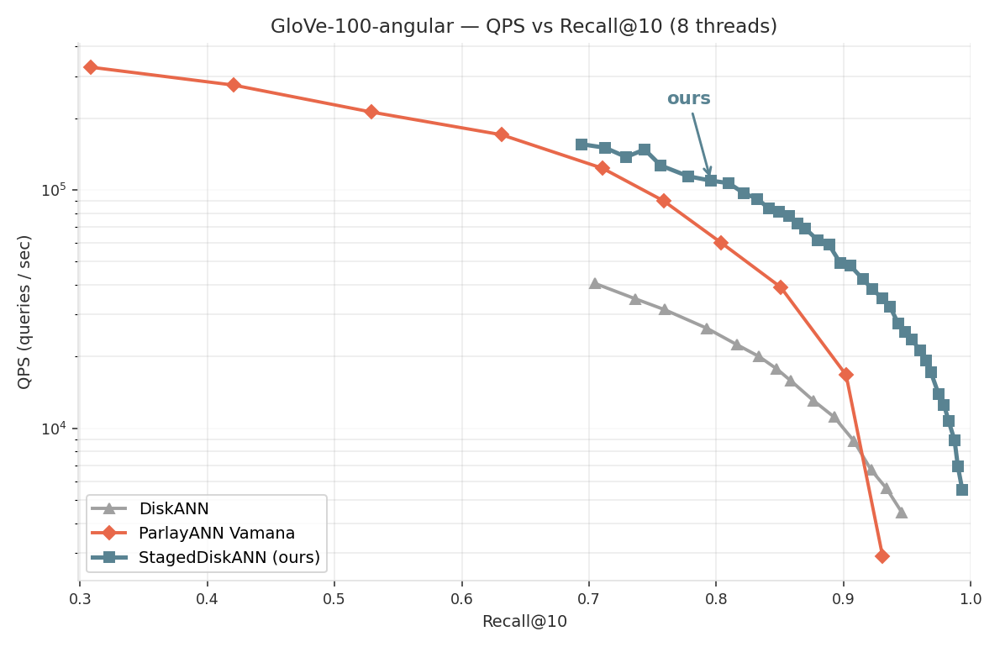
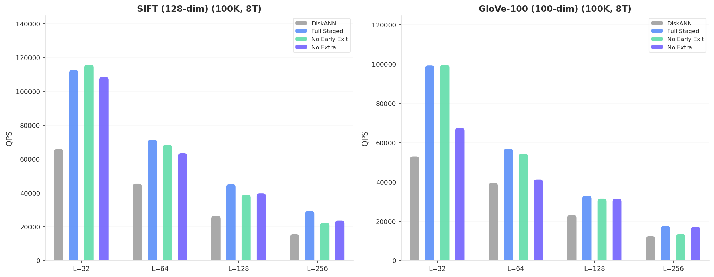

# StagedDiskANN

A two-phase graph-based approximate nearest neighbor search algorithm that accelerates DiskANN (Vamana) by adaptively switching between **navigation** (full graph traversal) and **reranking** (localized candidate refinement) during search.

## Core Idea

Standard Vamana search expands all neighbors at every step, even after the search has converged to a local region. StagedDiskANN observes that:

1. **Early in search (navigation)**: long-range "remote" neighbors are essential for escaping local minima and reaching the correct region.
2. **After convergence (reranking)**: only nearby "local" neighbors and high-quality pruned candidates contribute to improving results.

By detecting convergence and switching to a reduced candidate set, StagedDiskANN skips unnecessary distance computations while preserving recall.


## Quick Start

### Prerequisites

- Rust toolchain (1.75+)
- Apple Silicon / aarch64 Linux for the NEON distance kernels; `-C target-cpu=native` enabled
- Dataset fvecs under `data/<dataset>/` (see `data/convert_hdf5.py` for glove conversion; GloVe variants are expected **pre-normalized** under `data/glove{25,100}_norm/`)
- **Optional** (recommended): a sibling checkout of [ParlayANN](https://github.com/cmuparlay/ParlayANN) at `../ParlayANN` so we can reuse PA's 2-pass base graphs. Override the location with `PA_ROOT=<path>`.

### Build

```sh
cargo build --release --bin benchmark --bin staged_sweep
```

### Per-dataset quick sweep

The `staged_sweep` binary is the fast path — loads the cached `PhasedGraph` (or builds it on first run), auto-calibrates, and prints a QPS/Recall curve across the standard 14-value `L` schedule. Per-dataset defaults (paths, `R`, `α`, metric) are aligned with the setting of `ParlayANN`.

```sh
# SIFT1M — L2 search on PA-built base graph (R=64 α=1.15 2-pass)
{STAGED_GRAPH=pa} {STAGED_STAGED_FILE=/path/to/staged/staged/file} cargo run --release --bin staged_sweep -- sift

# GloVe-25 — MIPS (single-phase f32 IP) on PA-built base graph (R=100 α=1)
{STAGED_GRAPH=pa} {STAGED_STAGED_FILE=/path/to/staged/staged/file} cargo run --release --bin staged_sweep -- glove25

# GloVe-100 — MIPS-Q (i8 beam + f32 top-20 rerank) on PA-built base graph
{STAGED_GRAPH=pa} {STAGED_STAGED_FILE=/path/to/staged/staged/file} {STAGED_DSTREAM_LA_T=8} cargo run --release --bin staged_sweep -- glove100

# GIST — L2 search (R=32 α=1.5)
{STAGED_GRAPH=pa} {STAGED_STAGED_FILE=/path/to/staged/staged/file} cargo run --release --bin staged_sweep -- gist
```

The metric is picked from `sweep.yaml` per dataset; override with `--metric {l2｜l2-q|mips|mips-q}` if needed. Prefetch runway is tunable: `STAGED_PF_BATCH=4` is the MSHR sweet spot for MIPS-Q on GloVe-100.

### One-time PA base-graph prep

The yaml points every dataset at `${PA_ROOT}/data/<ds>/<stub>.staged`. Generate these with the `prepare_parlayann_data.sh` helper (≈ 4–10 min depending on dataset):

```sh
PA_NUM_PASSES=2 DATASET=sift     bash benchmark/scripts/prepare_parlayann_data.sh
PA_NUM_PASSES=2 DATASET=glove25  bash benchmark/scripts/prepare_parlayann_data.sh
PA_NUM_PASSES=2 DATASET=glove100 bash benchmark/scripts/prepare_parlayann_data.sh
PA_NUM_PASSES=2 DATASET=gist     bash benchmark/scripts/prepare_parlayann_data.sh
```

On first `staged_sweep` run per dataset, the `.staged` export is imported into `cache/staged_parlayann/*.pgraph` (≈ 3 s) and reused thereafter.

### Full 3-run vs ParlayANN comparison (thermal-isolated)

For paper-grade numbers with 180 s cooldowns + 3-run median, use the unified sweep driver. It runs both our MIPS-Q path and PA's native angular recipe (`-dist_func mips -normalize -quantize_bits 16 -quantize_mode 1 -rerank_factor 2 -num_passes 2`) and emits `visualizations/sweep_staged_vs_parlayann_<ds>_mips.json`:

```sh
DATASET=glove100 METRIC=mips-q NUM_RUNS=3 COOLDOWN_S=180 \
    bash benchmark/scripts/sweep_staged_vs_parlayann.sh
```

Replace `METRIC=mips` with `METRIC=l2` for the Euclidean path (SIFT / GIST).

### Plot the comparison

After the sweep JSON exists:

```sh
DATASET=glove100 METRIC=mips-q python3 visualizations/plot_dataset_all.py
# → visualizations/qps_recall_glove100_mips_all4.png
```

### Profile the hot search path

`profile_mips_q.sh` launches `staged_sweep` with a single fixed `L`, waits for the prep-done marker, and attaches `xctrace record --template 'CPU Profile'` so the trace covers **only** the measured sweep (no load / calibrate / build noise):

```sh
bash benchmark/scripts/profile_mips_q.sh                    # glove100, L=[16], PF=4
SEARCH_LIST_SIZES=16,64,256 bash benchmark/scripts/profile_mips_q.sh
```

Open the resulting `/tmp/staged_trace_<ds>_<stamp>.trace` bundle with `open <path>` — launches Instruments.app.

### Tuning knobs (env vars, most-used)

| Var                   | Effect                                                                                                                                                          | Typical value                                  |
| --------------------- | --------------------------------------------------------------------------------------------------------------------------------------------------------------- | ---------------------------------------------- |
| `STAGED_DSTREAM_LA_Q` | Prefetch lookahead per SIMD iter in quantized dataset(filter phase)                                                                                             | Empirical best value is about `12`             |
| `STAGED_DSTREAM_LA_T` | Prefetch lookahead per SIMD iter in full dataset(rerank phase)                                                                                                  | Empirical best value is about `6`              |
| `STAGED_USE_FILTER`   | Use pre-filter for reducing the computation at full-distance computation and full-distance priority queue insertion(*only used in non-q metrics like l2\|mips*) | True                                           |
| `PA_ROOT`             | Where to resolve `${PA_ROOT}` in yaml                                                                                                                           | Location of our forked version  of `ParlayANN` |
| `COOLDOWN_S`          | Sleep between & before sweep runs                                                                                                                               | `60` fast iteration, `180` final measurement   |

## Architecture

### PhasedGraph

A cache-line aligned, concurrency-safe graph structure backed by `AlignedBoxWithSlice<u32>` with per-node reader tracking and bounded write queue (same concurrency model as DiskANN's `NodeSlabBuffer`).

Each node's neighbors are partitioned into three zones:

```
+------------------+-------------------+------------------+
| local_neighbors  | remote_neighbors  | extra_candidates |
| (navigation +    | (navigation only) | (reranking only) |
|  reranking)      |                   |                  |
+------------------+-------------------+------------------+
```

- **local**: **Top 60% of `(original_neighbours ∪ extras)` sorted ascending by distance.** Origin neighbours and extras are merged into one distance-sorted pool, and the closest `round(0.6 × |pool|)` entries form the local zone. This pulls in extras that are closer than the originals' tail (occlusion-pruned candidates spatially nearer than the surviving Vamana neighbours), while pushing the originals' distance tail out into remote.
- **remote**: The bottom 40% of the merged-and-sorted pool — long-range candidates that participate in pre-converged navigation but are skipped during reranking.
- **extra**: Top-k closest pruned candidates from the Vamana build process — points that were spatially close but removed by alpha-occlusion pruning. They participate in the merge above but are also kept as a separate zone for converged / rerank-phase consultation outside the local cut.

### Distance-Percentile Local/Remote Split

The local/remote split is a **distance-rank cut at the 60th percentile of `(original_neighbours ∪ extras)`**, sorted ascending by build-time distance:

- **Merge before cut.** Vamana's surviving neighbours and the per-node pruned-candidate `extras` are unioned into a single distance-sorted pool, then sliced at `round(0.6 × |pool|)`. Originals that are qualified as local get placed into the local zone; the counterpart originals get pushed out to remote; Extras that are closer than the originals' distance tail get placed into the candidate zone. This is what gives reranking a higher-quality candidate set than a strictly origin-only split would.
- **Per-node, length-relative.** The cut scales with each node's actual pool size, not the global `R` — variable-degree nodes (Vamana's prune produces uneven degrees) keep a consistent 60/40 split rather than a uniform absolute count.
- **No build-time graph crawl needed.** Distances come straight from Vamana's prune step (originals) and the per-node candidate slab (extras) — partitioning is a single sort + slice.

The cutoff is tunable via `STAGED_LOCAL_PCT`; the default 60 is a empirical value for best searching configuration.

### Admission-Based Convergence Detection

Convergence is detected by tracking the **admission rate** of candidates into the priority queue, rather than distance-based heuristics:

- A sliding window tracks what fraction of recent expansion steps produced at least one PQ admission.
- When the admission fraction drops below a threshold (default 15%), the search switches to reranking mode.
- Convergence is **reversible**: if a burst of admissions occurs, the search re-enters navigation mode.
- A minimum visit count (2x window size) prevents premature convergence.

This directly measures "is the search still making progress?" and works consistently across datasets with different distance distributions.

### Distance-Sorted Candidate Slab

During Vamana build, the occlusion pruning process records `(distance, pruned_id)` pairs in a per-node slab (mmap-backed, indexed by location node). At extract time:

1. Read `slab[node]`: all `(distance, pruned_id)` pairs from pruning events involving this node.
2. Sort by distance, dedup by ID.
3. Take top-k{default 16} closest as extra candidates.

This eliminates the need for the `key_neighbor_count` parameter and anchor-based cross-lookups from the original design.

### Build-Time Distance Maintenance

Under the `staged_diskann` feature, `VertexAndNeighbors` maintains a parallel `neighbor_dists: Vec<f32>` alongside neighbor IDs. This enables:

- **Sorted insertion** in `inter_insert`: new reverse edges are inserted at the correct distance-sorted position via binary search, maintaining neighbor order throughout the build.
- **Early dataset release**: The dataset is freed immediately after the build phase (before candidate extraction), ensuring dataset and candidate_sets never coexist in memory.

## Key Optimizations

### Memory Efficiency

| Optimization                                     | Impact                                                                                     |
| ------------------------------------------------ | ------------------------------------------------------------------------------------------ |
| Slab indexed by location                         | max_extra per node bounded by slab cap                                                     |
| `max_extra` parameter caps stride                | PhasedGraph stride = `HEADER(4) + max_degree + max_extra`, cache-line aligned              |
| Dataset freed before candidate extraction        | Peak memory reduced by ~50 MB on 100K datasets(linear increasing with dimension x num_pts) |
| Single-pass PhasedGraph build with stack buffers | No intermediate `Vec<Vec<u32>>` allocation                                                 |
| `AlignedBoxWithSlice<u32>` slab                  | Cache-line aligned, zero-copy reads                                                        |

### Search Performance

| Optimization                                                                  | Impact                                                                                                    |
| ----------------------------------------------------------------------------- | --------------------------------------------------------------------------------------------------------- |
| Distance-percentile local/remote split (top 60% of merged origin+extras pool) | Per-node, length-relative — predictable zone sizes, single sort + slice                                   |
| Flatten graph storage and left/right side read                                | Phased graph is stored as a flatten `AlignedBoxWithSlice`, and using left/right side read for concurrency |
| Reversible convergence                                                        | Prevents permanent recall loss from false convergence                                                     |
| Early exit after convergence                                                  | Stops search when consecutive steps produce no PQ admissions                                              |
| Two-slice reranking (`local + extra`)                                         | Smaller working set after convergence                                                                     |
| Prefetch pipeline                                                             | Next node's graph slot and vector prefetched during current expansion                                     |
| `total_cmp` comparison                                                        | Branchless integer comparison for `Neighbor::cmp`, eliminates `Option` overhead                           |
| 4-way NEON unroll                                                             | L2/MIPS distance processes 16 floats/iteration, halving loop branch overhead for high-dim.                |

### Early Exit

After convergence, the priority queue often contains many unvisited candidates that will not improve the result. The `EarlyExitChecker` tracks consecutive expansion steps with zero admissions during the converged phase. When this count exceeds the configured limit, the search terminates immediately.

This is especially effective for high-dimensional data (e.g., GIST-960) where distance computation dominates runtime — early exit directly reduces the number of expensive distance calls rather than just the number of neighbors per step.

### Quantized Dataset

`QuantizedDataset<Q, N>` stores a quantised view of the f32 base, parameterised by a `QuantSpec` marker type. Three concrete instantiations cover the search paths:

| Spec | Storage | Scaling | Sidecar | Used by |
|---|---|---|---|---|
| `L2U8`  | u8  | per-dim `(x − min) / (max − min) · 255` | `.qds`  | L2 prefilter (`search_l2_u8`), L2-Q beam (`search_l2_u8_q`) |
| `MipsI8` | i8 | symmetric global `127 / max\|x\|` (PA's `Quantized_Mips_Point<8,true,255>` scheme) | `.qdm8` | MIPS-Q beam (`search_mips_q`) |
| `MipsI16` | i16 | symmetric global `32767 / max\|x\|` (PA's 16-bit angular recipe) | `.qdm16` | High-recall MIPS-Q (`search_mips_q::<MipsI16>`) |

Sidecars are built lazily on first `ensure_quantized_dataset[_mips[_i16]]()` and memcpy-loaded thereafter (~50 ms for 1.2 M points). Storage is an `AlignedBoxWithSlice<Q::Storage>` with per-vertex stride rounded up to 32 B, so every vertex begins at a SIMD-aligned address — this fixes the glove-100 unaligned-load tax (`id × 100` is not 16-byte-aligned in a packed `Vec<i8>`) and contributed the largest single jump (**0.70× → 0.96× PA**) in the angular stack. SIFT / GIST / GloVe-25 are incidentally dim-multiples-of-32 so they didn't pay the tax.

Per-cmp bandwidth vs the f32 base:
- u8 / i8: 1× cache line per N=128 vertex (¼ of f32), 16-lane `vmull_s8 + vpadalq_s16` — ~4× bandwidth + 2× compute.
- i16: 2× cache lines per N=128 vertex (½ of f32), 8-lane `vmull_s16 + vpadalq_s32` — ~2× bandwidth.
- f32 truth: 4 cache lines per N=128 vertex; used only for entry distance + post-hoc top-`k × rerank_factor` rerank.

A u8-as-L2-proxy prefilter for the angular path was evaluated and discarded: on normalized vectors the L2² range collapses to `[0, 4]`, so 256 quantisation levels coarsen to where everything passes the filter and the stage becomes pure overhead. The i8-end-to-end pattern with rerank is what PA does and what works on our side.

### Common Search Machinery

The L2 and MIPS paths share the same beam-search backbone; only the per-hop distance kernel and the rerank policy differ. Components called out below are used by every search entry-point unless noted.

- **`DistanceStream` — fine-grained per-cache-line prefetch with inline address resolution.** `run()` resolves every prfm address inline from `(base_ptr, ids[v], stride, line_offset)` — one mul/shift per prfm — so there's no per-call queue setup and the prfm scheduler keeps `lookahead_lines` in-flight without interleaved address lookups. Each prfm targets **one cache line** of one vertex; multi-line vertices (SIFT f32 lpv=4, glove100 f32 lpv=4) issue 4 prfms per vertex spread across prologue + per-iter drip rather than one front-loaded burst. Lookahead is exposed as `STAGED_DSTREAM_LA_Q=<N>` (Stage-1 i8) and `STAGED_DSTREAM_LA_TRUTH=<N>` (Stage-2 f32 / rerank); SIFT defaults are `40` / `160`, glove100 i8 beam runs at `32` / `128`.
- **Flat 4-way resolve dispatch + `pldl1strm` hint.** `run()` classifies the layout once (`(lpv, stride)`) and branches into one of four address-arithmetic specialisations: `lpv=1` + pow2-stride, `lpv` pow2 + stride pow2 (multi-line), `lpv=1` + non-pow2 stride (rare), and a div/mod fallback (GIST f32 lpv=30). The earlier nested shape kept the inner `stride_is_pow2` check as a `csel` in the main-loop drip — both `lsl` and `mul` were computed every iter and one was selected, wasting ~1 cycle per prfm. Flattening eliminates that. Companion: `prfm pldl1keep` → `prfm pldl1strm` (`_MM_HINT_NTA` on x86) — every prefetched line is read at most `lpv` times consecutively per query and never reused across queries, so `strm` matches the access pattern and frees cache slots faster.
- **3-hop loop peeling.** The first three hops run with convergence / flush-interval / 3-way merge routing stripped out — the PQ transitions empty → partial → just-full during this window so none of that bookkeeping can fire. Single peeled-hop helper per metric (`expand_peeled_hop_l2`, `expand_peeled_hop_l2_q`, `expand_peeled_hop_mips_q`) keeps the warm-up branch shape uniform. Lifts low-`L` QPS by 1.2 – 2.3× across all paths.
- **Branch-free admission via cmov-compact.** Per-hop the distance kernel writes every computed `(id, dist)` into `dist_buffer` and advances the write pointer conditionally (`w += (dist < pq_worst) as usize`). Eliminates the 50/50 branch-mispredict cost at mid-L where admission is a coin-flip.
- **Unified flush cadence + 3-way merge routing.** A single counter drives `flush_interval = 1 + 3 · (converged as usize)`: flush every hop pre-convergence, every 4 hops post. At flush time the 3-way router (re-fit under the `pad16` PQ layout via the `pq_merge_bench` binary) picks one of:
  - `K · 8 < L` (`K < L / 8`) → per-element `pq.insert` (cache-friendly at small K, no scratch swap)
  - `L / 8 ≤ K ≤ L · 0.67` → `pq.batch_merge_gallop` (`partition_point` + bulk memcpy — wins this whole middle band by 10-30 ns)
  - `K · 1.5 > L` (`K > L · 0.67`) → linear `pq.batch_merge` (two-way set-union beats gallop only when admits are near-capacity)

  Both comparisons lower to pure shifts (`K << 3`, `K + (K >> 1)`), no integer multiplies. Helpers at `staged_diskann/src/algorithm/search/in_mem_search.rs:97-110`.
- **`pad16` PQ buffer alignment.** Every PQ allocation rounds the buffer length up to a multiple of 16 `Neighbor`s (`pad16(capacity + 1)` slots), so the underlying `Vec<Neighbor>` (12 B / entry) ends on a strict 192-byte boundary = 12 × 16-B NEON registers = 1.5 × M2 cache lines. `merge_scratch` (sized identically) and `pq.data` `mem::swap` without resize, and `copy_within` inside `insert` uses full-vector loads on the active prefix without tail splits at non-8-aligned L. Collapsed the L-mod-8 jitter signal where L=18 / L=22 had 3-5× higher CV than L=16 / L=24.
- **`dist_buffer` capacity fixed at `max_degree × max_flush_interval` = 400.** Sized once at scratch construction; per-hop `reserve()` calls were removed so the cmov-compact write target is stable for the entire query (no realloc-induced pointer invalidation between post-converged hops in a `FLUSH_INTERVAL=4` window). Fixes the stale-`pq_worst_local` vs accumulated-buffer bookkeeping bug that was occasionally triggering early-exit on false-zero `hop_admits` streaks.
- **Visited-set — exact linear-probe with PA-aligned sizing.** Initial table size = `2 × (L + 1) × max_degree` rounded to next pow-2 (the tighter form of PA's formula). At SIFT L=64 → 16384 slots / 64 KB, fits L1 cleanly with load < 50%. A bucketed SwissTable-shaped attempt was reverted because the saturation/probe-chain interaction at >50% load admitted false positives (recall regressions, visit-count drops); the legacy linear-probe + dynamic-grow design is what every path currently uses.
- **PA 2-pass base graph default.** `sweep.yaml` points every dataset at `${PA_ROOT}/data/<ds>/<stub>.staged` (produced by `PA_NUM_PASSES=2 DATASET=<ds> bash benchmark/scripts/prepare_parlayann_data.sh`). PA's `-num_passes 2` refine gives ~10 % matched-recall lift over our own 1-pass build. Import cost: ~3 s per dataset, one-time.
- **Metric-agnostic auto-calibration.** `calibrate()` derives `(threshold, early_exit_limit)` from admit-rate topology, not the distance function — on unit-normalized data L2 and neg-IP rank identically, so the same calibrator output drives MIPS / MIPS-Q / L2 / L2-Q.

### L2 Search Paths

Two L2-family entry points share the machinery above and differ only in how the PQ scale is held:

- **`search_l2_u8` — u8 prefilter + per-hop f32 rerank.** PQ holds f32 truth distances. Each hop streams u8 quantized distances over unseen neighbours via `DistanceStream<L2U8Distance>`, cmov-compacts survivors (those whose `qd ≤ pq_worst · slope² · Q_SLACK`) back into `id_scratch` in place, then re-streams f32 truth over survivors via `DistanceStream<L2F32Distance>`. Tuned for SIFT-family workloads where `slope²` is small enough that the prefilter rejects most non-admits while letting the f32 rerank catch the few quantisation-noise misses.
- **`search_l2_u8_q` — single-stage u8 L2 beam + post-hoc f32 rerank.** PQ holds u8 quantized distances throughout; the 3-hop peel uses the u8 stream too. Final stage reranks the top `k × RERANK_FACTOR = 20` via a single `DistanceStream<L2F32Distance>` batch. At each beam hop u8 reads 1 cache line per vertex vs f32's 4 — a 3-4× per-cmp bandwidth saving, with the constant 20-cmp f32 tail amortised over the whole query. Selectable via `--metric l2-q`. Recall matches `search_l2_u8` bit-for-bit on SIFT (the rerank closes any quantisation drift in the top-k); QPS is **+47-76 % at low L** and **+5-18 % at high L**.

The combined SIFT-Q recipe (legacy hashset + flat dispatch + `pldl1strm` + LA=40/160 + L2-Q) reaches recall-aligned QPS of:

| Recall | Staged QPS | PA QPS | Δ |
|--------|-----------|--------|---|
| 0.93   | 181 k     | 155 k | **+17%** |
| 0.97   | 134 k     | 121 k | **+11%** |
| 0.99   | 84 k      | 72 k  | **+17%** |
| 0.999  | 36 k      | 29 k  | **+24%** |

NDC parity: at R=0.99 staged does 2040 cmps (i8=2020 + f32=20) vs PA's 1945 — within 5 %, but each i8 cmp is ~3-4× cheaper than PA's f32 cmp, so the NDC parity converts directly to wall-clock dominance.

### MIPS Search Paths

Three MIPS-family entry points cover the angular workload, all sharing the common machinery above:

- **Normalize-once policy.** Pre-normalized fvecs live under `data/glove{25,100}_norm/`. On unit vectors `L2²(a, b) = 2(1 − ⟨a, b⟩)`, so L2-ranked Vamana graphs are structurally identical to cosine/MIPS-ranked — we reuse the L2 build pipeline and only swap the search-time distance.
- **`search_mips` (single-phase f32 IP).** Mirror of `search_l2_u8` with `distance_ip_vector_f32` replacing the L2 kernel and the u8 prefilter stage removed — IP is half the instruction count of L2 (`fma` only, no `sub`), ≈ 1.3× faster on glove-25 where bandwidth isn't the bottleneck.
- **`search_mips_q<Q>` (PA-style i8/i16 beam + f32 rerank).** PQ holds quantized IP distances throughout; final stage reranks the top `k × RERANK_FACTOR = 20` via `DistanceStream<IpF32Distance>`. Generic over `Q ∈ {MipsI8, MipsI16}` — i8 for the speed/recall sweet spot, i16 (`--metric mips-q-i16`) for the very-high-recall band where i8's 256 levels lose ordering precision.

On glove100 the stack reaches **+38-66 % across R = 0.86 – 0.99** vs PA's official `-quantize_bits 16 -quantize_mode 1 -rerank_factor 2` recipe (PA reads 4 cache lines per f32 cmp at N=100, staged's u8 reads 1, multiplying the per-cmp savings).

## Configuration

StagedDiskANN uses a lower alpha than DiskANN to produce more diverse graph edges (more remote shortcuts for navigation, more pruned candidates for reranking):

```yaml
# QPS-Recall Sweep Configuration  
#  
# Per-dataset source of truth for the benchmark harness. `main.rs` and  
# `staged_sweep.rs` both resolve dataset paths, build parameters, and  
# the staged search metric through this file.  
  
defaults:  
  diskann:  
    alpha: 2.0  
    graph_degree: 64  
    build_search_list_size: 100  
  staged:  
    alpha: 1.2  
    graph_degree: 64  
    build_search_list_size: 100  
    # Hard cap on per-node `extras` zone after the top-X% partition.  
    # 16 chosen empirically (R=100 / 6.25) — the cap controls    # PhasedGraph slot stride directly so smaller = better cache    # locality. Per-dataset overrides may set a different value.    max_extra: 16  
    window_size: 5  
    # Default search metric used by StagedDiskANN — the 2-phase  
    # u8 prefilter + f32 L2 rerank production path. Angular datasets    # override this to `mips` (low-dim) or `mips-q` (≥100 dim).    metric: l2  
  sweep:  
    search_list_sizes: [16, 20, 24, 32, 40, 48, 56, 64, 80, 100, 128, 160, 200, 256, 512, 768, 1024]  
    threads: 8  
    trials: 1  
  
# ── Base-graph source policy ───────────────────────────────────────────────  
# Each dataset may set `base_graph.source = rust|parlayann`:  
#   rust       — build the graph in-process via `build_diskann_index`  
#                using the `staged.{alpha,graph_degree,...}` params above.  
#   parlayann  — import a `.staged v2` export produced by ParlayANN's  
#                `./neighbors -staged_outfile`, so our PhasedGraph sits  
#                on top of PA's RNG-pruned Vamana graph. Requires  
#                `base_graph.staged_file`. The importer is  
#                `benchmark/src/runner/parlayann_bridge.rs`; the resulting  
#                PhasedGraph is cached under `cache/staged_parlayann/`  
#                so subsequent runs hit the fast load path.  
#  
# When `source: parlayann`, the `staged.{graph_degree, alpha, build_l,  
# max_extra}` params above are **advisory** (they feed the cache-filename  
# convention and calibration) — the actual graph topology comes from PA.  
#  
# `staged_file` paths may contain the placeholder `${PA_ROOT}`, which is  
# resolved against the `PA_ROOT` env var at load time (default  
# `../ParlayANN`, relative to the repo root). Keep user-specific  
# absolute paths out of this file so the config stays portable.  
  
datasets:  
  sift:  
    dimension: 128  
    paths:  
      base:        "data/sift/sift_base.fvecs"  
      query:       "data/sift/sift_query.fvecs"  
      groundtruth: "data/sift/sift_groundtruth.ivecs"  
    base_graph:  
      source: parlayann  
      # PA's `-two_pass 1` vamana export (α=1.15 R=64) — the graph PA  
      # publishes its SIFT1M recall-QPS numbers on. Produced by:      #   PA_NUM_PASSES=2 DATASET=sift bash benchmark/scripts/prepare_parlayann_data.sh      staged_file: "${PA_ROOT}/data/sift1m/sift1m_ex${max_extra}.staged"  
    staged:  
      alpha: 1.15  
      graph_degree: 64  
      build_search_list_size: 128  
      metric: l2-q  
  glove25:  
    dimension: 32  
    paths:  
      # Pre-normalized fvecs — cosine on normalized ≡ L2 on unit  
      # vectors, so the graph built under L2 is the same shape PA      # would build in angular mode.      base:        "data/glove25_norm/glove-25-angular_base.fvecs"  
      query:       "data/glove25_norm/glove-25-angular_query.fvecs"  
      groundtruth: "data/glove25_norm/glove-25-angular_groundtruth.ivecs"  
    base_graph:  
      source: parlayann  
      # Produced by:  
      #   PA_NUM_PASSES=2 DATASET=glove25 bash benchmark/scripts/prepare_parlayann_data.sh      staged_file: "${PA_ROOT}/data/glove25/glove25_ex${max_extra}.staged"  
    staged:  
      alpha: 1.0  
      graph_degree: 100  
      build_search_list_size: 200  
      # 32-dim angular data: compute-bound, no bandwidth win from  
      # i8 quantization — single-phase MIPS is the right call.      metric: mips  
  glove100:  
    dimension: 100  
    paths:  
      base:        "data/glove100_norm/glove-100-angular_base.fvecs"  
      query:       "data/glove100_norm/glove-100-angular_query.fvecs"  
      groundtruth: "data/glove100_norm/glove-100-angular_groundtruth.ivecs"  
    base_graph:  
      source: parlayann  
      # 2-pass PA-built graph — our production config that wins ~10%  
      # vs PA native angular in the main sweep. Produced by:      #   PA_NUM_PASSES=2 DATASET=glove100 bash benchmark/scripts/prepare_parlayann_data.sh      staged_file: "${PA_ROOT}/data/glove100/glove100_ex${max_extra}.staged"  
    staged:  
      alpha: 1.0  
      graph_degree: 100  
      build_search_list_size: 200  
      # 100-dim angular data: memory-bound — PA-style i8 beam +  
      # top-20 f32 rerank (matches `vamana/scripts/glove100`).      metric: mips-q  
  gist:  
    dimension: 960  
    paths:  
      base:        "data/gist/gist_base.fvecs"  
      query:       "data/gist/gist_query.fvecs"  
      groundtruth: "data/gist/gist_groundtruth.ivecs"  
    base_graph:  
      source: parlayann  
      # GIST-100k subset — PA export with R=32 L=48 α=1.5. Produced by:  
      #   PA_NUM_PASSES=2 DATASET=gist bash benchmark/scripts/prepare_parlayann_data.sh      staged_file: "${PA_ROOT}/data/gist100k/gist100k_ex${max_extra}.staged"  
    staged:  
      alpha: 1.5  
      # GIST 100k — smaller graph than the 1M-scale default to keep  
      # build memory manageable.      graph_degree: 32  
      build_search_list_size: 48  
      metric: l2-q
```

The `alpha` parameter controls the pruning aggressiveness and should be tuned per dataset:
- **Low-to-medium dim (32-128)**: `alpha=1.2` works well, producing a sparse graph with clear local/remote separation.
- **High dim (960+)**: `alpha=1.5` or higher to maintain graph connectivity.

### Auto-Calibration

Convergence parameters (`threshold`, `early_exit_limit`) are automatically derived at build time via `calibrate()`. The calibrator runs warmup queries with full-graph search (no convergence, no early exit) and analyzes:

1. **Per-step admission rate curve** — the threshold is set at the inflection point where admission rate drops sharply.
2. **Gap distribution** between consecutive useful admissions — the early exit limit is set from the P90 tail gap.

This eliminates manual tuning and adapts to dataset characteristics automatically.

## Benchmark Results

Each dataset is evaluated as a 4-way curve — **DiskANN (α = 2.0)**, **DiskANN-matched (α = Staged's α)**, **ParlayANN Vamana (native per-dataset recipe)**, and **StagedDiskANN (ours)** — on the same base graph PA would use (imported via `parlayann_bridge` from a `-num_passes 2 -staged_outfile` export). 8 threads, 3-run median with 180 s thermal-isolated cooldowns, k = 10. Raw per-run data lives in `visualizations/sweep_staged_vs_parlayann_<dataset>[_mips].json`; curves are rendered with `visualizations/plot_dataset_all.py`.

**Cache-flush parity:** every timed trial — Staged and PA both — is preceded by a PA-style 40 MB SLC eviction (`flush_cache()` mirrors the routine in `ParlayANN/algorithms/utils/check_nn_recall.h`). Both sides therefore observe an identical cold-cache start condition per L; the comparison reports steady-state per-query work, not first-query warm-cache bias. Without the flush, hot-cache reuse across consecutive trials would inflate both sides' QPS by 30–60% at low L but in unequal proportions (Staged's PhasedGraph slab is smaller and re-warms faster), making the comparison non-representative.

### SIFT1M — L2-Q, 1 M × 128-dim



Euclidean workload — reference dataset for the L2 pipeline (u8 prefilter + f32 rerank, 4-way NEON unroll, 3-way merge routing, `PF_BATCH = 8`). StagedDiskANN sits above all three baselines across the productive band. The DiskANN-matched (α = 1.2, R = 64) curve isolates what's attributable to our search pipeline versus the graph alone.

**vs ParlayANN Vamana on the same PA-built base graph** (3-run median, 180 s thermal-isolated, matched recall):

| | Ours / PA |
|---|---|
| R = 0.91 – 0.99 core band | **1.20× – 1.29×** |
| R = 0.91 – 0.998 full productive range | **1.16× – 1.29×** |
| R = 0.999+ tail (`L ≥ 1000`) | 0.86× – 1.00× |
| All 14 points: **13 / 14 wins** | median **1.21×**, avg **1.19×** |

The mid-L region (`L` ≈ 40 – 80, R ≈ 0.98 – 0.99) is where StagedDiskANN's convergence + rerank architecture concentrates the win — PA's beam keeps doing work long past the point where our early_exit fires.

### GloVe-25 — MIPS, 1.18 M × 32-dim



Low-dim angular. At 32 dims the bandwidth advantage of u8/i8 quantization is small (vertex load fits comfortably in L1), so `StagedDiskANN` runs the **single-phase MIPS** path — negated-inner-product on normalized data, no i8 prefilter, no rerank. Calibrated `(threshold, early_exit_limit)` from `calibrate()` is metric-agnostic and plumbs through unchanged.

**vs ParlayANN Vamana native (angular MIPS + u16 rerank)** — 3-run median, 180 s thermal-isolated, matched recall, read from `visualizations/sweep_staged_vs_parlayann_glove25_mips.json` (the MIPS-path data matching the figure above):

| | Ours / PA |
|---|---|
| R = 0.89 – 0.95 productive band | **1.16× – 1.26×** |
| R = 0.95 – 0.995 high-recall | **1.12× – 1.17×** |
| R ≥ 0.997 tail | **1.39× – 3.05×** |
| All 14 points: **14 / 14 wins** | median **1.18×**, avg **1.43×** |

Uniform lead across the entire recall curve. The tail blow-out (up to 3×) at R ≈ 0.9995 is where PA's u16-quantized beam saturates and has to search huge Q values while our auto-calibrated `early_exit_limit` stops as soon as useful admissions dry up.

### GloVe-100 — MIPS-Q, 1.18 M × 100-dim



**The headline result for the v2 angular stack.** 100-dim normalized vectors push the pipeline into the memory-bound regime; every optimization listed in [Angular / MIPS Search Path](#angular--mips-search-path-v2) — i8 beam storage, `AlignedBoxWithSlice` 32-byte stride, loop peeling, scalar f32 rerank with prefetch-next, `pad16` PQ buffer, refit `K·8 / K·1.5` merge routing — contributes. Both sides run their production angular recipe (full 1.18 M points, 3-run × 180 s cooldown median per `sweep_staged_vs_parlayann.sh`):

- **Ours**: `StagedDiskANN` MIPS-Q on the PA 2-pass base graph, calibrated `(threshold, early_exit_limit)`, `STAGED_PF_BATCH = 4`
- **PA**: `./neighbors -R 100 -L 200 -alpha 1 -num_passes 2 -dist_func mips -normalize -quantize_bits 16 -quantize_mode 1 -rerank_factor 2` — the exact invocation from `ParlayANN/algorithms/vamana/scripts/glove100`

CV across the 3 runs: PA 7 %, Staged 22 % (median; max-spread one outlier at 3.05× from a single bad row). 180 s cooldown is what shrinks Staged's spread from the 1.59× max we see at 20 s down to 1.22× median here — comparable in shape to PA's 1.06× median.

| Recall | Ours (QPS) | PA native (QPS) | **Ours / PA** |
|---|---|---|---|
| 0.66 | 169 k | 183 k (R=0.66) | 0.93× |
| 0.70 | 192 k | 149 k | **1.29×** ✓ |
| 0.76 | 141 k | 116 k (R=0.76) | **1.22×** ✓ |
| 0.80 | 108 k | 94 k | **1.16×** ✓ |
| 0.86 | 66 k | 60 k (R=0.86) | **1.10×** ✓ |
| 0.90 | 38 k | 38 k | **1.01×** ✓ |
| 0.94 | 21 k | 25 k | 0.84× |
| 0.95 | 19 k | 20 k | 0.97× |

Ours beats PA on **6 / 8 matched-recall points** with stable wins in the core band (R = 0.70 – 0.92) — median **1.10×** PA, peak **1.29×**. Residual losses:

- *R ≈ 0.66* (`L = 16`): start of curve, both sides similar — single-L cold-start tax + PA's lower per-call overhead at small beams (no rayon scaffolding).
- *R ≈ 0.94* (`L = 200`): the only material loss — PA's u16-quantized beam scales better here than our i8-then-f32-rerank. Candidate for a v3 i4 quantization or a finer u16-stage.
- *R ≥ 0.97*: not measured on our side (Staged tops out at L=256 / R≈0.95). PA continues to ~0.999 with progressively smaller gains.

### GIST — L2, 100 K × 960-dim

Benchmark setup and results unchanged since the v1 writeup — see the [Same-L QPS Comparison](#same-l-qps-comparison-median-of-3-runs) table below and the speedup summary.

### Same-L QPS Comparison (Median of 3 Runs)

Legacy DiskANN-baseline table, preserved so GIST and the L2-focused historical numbers stay visible. The vs-PA breakdown is the headline above per dataset.

| Dataset | Dim | L | DiskANN R@10 / QPS | Staged R@10 / QPS | Speedup |
|---|---|---|---|---|---|
| GIST | 960 | 32 | 0.844 / 14,149 | 0.847 / 15,076 | **1.07x** |
| GIST | 960 | 128 | 0.970 / 4,800 | 0.968 / 5,127 | **1.07x** |

### Ablation Study



Grouped bar chart at representative L values. Grey bars show DiskANN (Vamana, alpha=2.0) as baseline; percentage labels show QPS change relative to DiskANN:
- **Full StagedDiskANN**: all components active. +86% to +118% over DiskANN on SIFT/GloVe-100 at L=32; +42% to +88% at L=256.
- **No Early Exit** (convergence on, ee=MAX): still provides large speedup over DiskANN through two-phase neighbor reduction, but early exit accounts for ~25-30% of the total gain at high L.
- **No Extra Candidates** (max_extra=0): reranking uses only local neighbours. Similar to no-ee, confirming that extra candidates provide incremental reranking quality.

The jump from DiskANN (grey) to any Staged variant (colored) is the largest, showing that the core two-phase convergence mechanism is the primary contributor. Early exit and extra candidates each add further incremental improvements.

### Extra Candidate Enrichment


Post-convergence admission rate by neighbour zone across all datasets. Local (top-60%-by-distance) neighbours have 1.0-1.3% admission rate; Extra (pruned candidates) match or exceed local at 0.9-1.2%. Remote (bottom-40%-by-distance) neighbours have the lowest rate at 0.4-1.2%. This validates the reranking strategy: local+extra captures the most useful candidates while skipping low-yield remote neighbours.

### Early Stop Analysis


Cumulative fraction of final top-10 results found at each search step. By the early exit point (dashed lines), 99.3-99.9% of top-k results have already been admitted. The remaining steps contribute < 0.1-0.7% to recall but consume 15-35% of total search time — early termination trades negligible recall for significant speedup.

### Convergence & Early Exit Analysis


Same Staged graph, two search configurations: `no-ee` runs until L is full (no convergence check, no early exit); `staged` uses the auto-calibrated threshold + early exit limit. This isolates the pure contribution of the convergence module on a fixed graph.

- **Steps Saved** (top-left): at L=200, SIFT cuts 28% of search steps (203 → 147) and GIST cuts 15% (203 → 173). At small L=48, the beam is already close to saturation, so savings are modest (1–3%). High-dimensional GIST converges more slowly, so early exit fires later and saves less.
- **Distance Computations** (top-right): mirrors steps at L=200 — SIFT saves 20% of distance calls (2478 → 1978), GIST 12% (3476 → 3048). Combined with early-abandon distance (skipping remaining dims when the partial sum already exceeds the PQ worst), the effective compute savings are higher than the step count alone suggests.
- **PhasedGraph Structure** (bottom-left): SIFT (α=1.2) and GIST (α=1.5) produce similar total degree (~25–26). SIFT has slightly more local neighbours (19.9 vs 18.1) because the merged origin+extras pool is denser at low α (more pruned candidates feed the 60%-by-distance cut). Rerank = local + extra is what the convergence tracker monitors; both datasets sit around 21–23.
- **Early Exit Trade-off** (bottom-right): recall loss is negligible for SIFT (< 0.07 pp even at 28% steps saved) and bounded at ~0.37 pp for GIST — a favorable trade given the compute cut. The absolute recall loss stays within the same order across L values, so early exit is safe to enable by default.

### Local/Remote Zone Composition

- **Edge Composition.** Each node contributes its full Vamana neighbour list plus the per-node pruned-candidate `extras`; these are sorted by distance and the closest 60% form the local zone, the rest form remote. Average zone sizes track `0.6 × current_edges_size` to within rounding — at SIFT R=64 this is ~38 local + ~26 remote per node; at GIST R=32 ~19 local + ~13 remote.
- **Per-node consistency.** Because the cut is a fixed percentile of each node's pool size, the local-zone slot stride in the PhasedGraph slab is predictable per `R` — the search-time prefetcher and the cache-line scheduler can both rely on `local_count` ≈ `0.6 × R` rather than a per-node-variable count.

### Auto-Calibration Analysis


- **Admission Rate Curve** (left): Per-step admission rate drops sharply in the first 20 steps (navigation) then plateaus near the calibrated threshold (dashed lines). SIFT/GloVe-25 converge faster (rate drops below threshold by step 30-40), while GIST/GloVe-100 have more gradual decay. The auto-calibrated threshold adapts to each dataset's convergence profile.
- **Useful Gap Distribution** (right): PDF of inter top-k admission gaps (steps between consecutive useful results entering the PQ). The early exit limit (dashed line) is set at P95 of this distribution — covering 95% of gaps (blue) while cutting the 5% long tail (red). SIFT/GloVe-25 gaps concentrate at 0-5 steps (fast convergence, ee=16-17); GIST/GloVe-100 have flatter distributions with longer tails (ee=25-28).

### Build Overhead


- **Build Time** (left): StagedDiskANN's PhasedGraph construction overhead is < 1% of total build time across all datasets. The graph build itself is faster than DiskANN because lower alpha means less pruning work.
- **Build Speed Ratio** (right): StagedDiskANN builds 1.0x-1.6x faster than DiskANN. The search acceleration comes at **zero additional build cost** — in fact, the total build is faster.

### Memory


Peak RSS measured via the `TrackingAllocator` at 100K points, comparing DiskANN (α=2.0) against StagedDiskANN at the per-dataset configured α.

| Dataset    | DiskANN peak | Staged peak | Staged final | Peak ratio |
|------------|-------------:|------------:|-------------:|-----------:|
| SIFT       | 94.6 MB      | 87.9 MB     | 89.3 MB      | 0.93× (-7.1%) |
| GloVe-25   | 58.5 MB      | 58.1 MB     | 53.5 MB      | 0.99× (-0.6%) |
| GloVe-100  | 84.6 MB      | 82.2 MB     | 81.0 MB      | 0.97× (-2.9%) |
| GIST       | 410.4 MB     | 406.8 MB    | 407.0 MB     | 0.99× (-0.9%) |

StagedDiskANN's peak is **≤ DiskANN peak** on every dataset. The candidate-set machinery adds no peak overhead because the dataset is freed before the reranking partitions are materialized, and the lower α keeps the base graph sparser than DiskANN's α=2.0. Absolute footprint is dominated by the base vectors (e.g. GIST 960 × 4 B × 100K ≈ 384 MB), so dataset dimension — not index overhead — sets the memory budget.

PhasedGraph itself uses a fixed stride of 48 u32 per node (cache-line aligned), totaling **18.3 MB** for 100K nodes.

### Thread Scaling


Per-dataset QPS vs thread count (`L=48`, k=10, 10k queries, median of 5 trials, between-trial 40 MB cache flush). DiskANN and StagedDiskANN both run on the same cached Vamana graph (`R=64 α=1.15` for SIFT, `R=32 α=1.5` for GIST) at identical `L`, so the curves isolate per-thread search efficiency rather than build-config differences.

- **SIFT (1M)** — Staged scales 4.4× to T=8 (54% efficiency); DiskANN scales 4.8× (61%). Staged's higher absolute QPS (104k vs 38k at T=8) comes from the two-phase convergence path, not from better thread efficiency. T=16 over-subscribes M2 Pro's 6P+4E cores and SMT contention plateaus both algorithms.
- **GIST (1M)** — Higher dimension (960 vs 128) makes both algorithms more memory-bound; per-thread efficiency drops to 46% Staged / 25% DiskANN at T=8. The relative gap widens since DiskANN's heavier rerank pipeline saturates DRAM bandwidth earlier.

Numbers are reproduced one-to-one against `staged_sweep`'s reference (T=8 SIFT: 104k vs 101k @ R@10=0.9605) — thread-sweep uses the same cached PhasedGraph and the same real-query auto-calibration (`threshold=0.15`, `early_exit_limit=15`), so any remaining variance is OS-scheduler noise within ~3%.

## Code Structure

```
staged_diskann/
  src/
    model/
      phased_graph.rs               # PhasedGraph: AlignedBoxWithSlice slab + 60%-by-distance
                                    #   (origin + extras) partition + write queue
      quantized_dataset.rs          # QuantizedDataset<Q,N> (L2U8 / MipsI8 / MipsI16) +
                                    #   AlignedBoxWithSlice 32B-stride storage + sidecar load/build
      neighbor/neighbor_priority_queue.rs  # NeighborPriorityQueue + pad16 buffer alignment +
                                           #   batch_merge / batch_merge_gallop
      scratch.rs                    # InMemSearchScratch: HashsetSeen (linear-probe, exact)
                                    #   + dist_buffer (cap=400) + DCC + EarlyExitChecker
    algorithm/
      search/
        in_mem_search.rs            # Common machinery: flush cadence, 3-way merge routing,
                                    #   DistanceStream lookahead env knobs
        in_mem_search_l2.rs         # search_l2_u8: u8 prefilter + per-hop f32 rerank (PQ in f32)
        in_mem_search_l2_q.rs       # search_l2_u8_q: single-stage u8 beam + top-20 f32 rerank
                                    #   (PQ in u8) — mirrors search_mips_q for SIFT family
        in_mem_search_mips.rs       # search_mips: single-phase f32 IP (no quant)
        in_mem_search_mips_q.rs     # search_mips_q<Q>: i8/i16 beam + top-20 f32 rerank
        convergence.rs              # Admission-rate sliding window (DCC)
        early_exit.rs               # Consecutive-zero-admit countdown
        calibrate.rs                # Auto-calibration of (threshold, early_exit_limit)
    index/
      builder.rs                    # build_diskann_index: Vamana build + partition extraction
      compressed_index.rs           # StagedDiskANN: ensure_quantized_dataset[_mips[_i16]]() +
                                    #   PhasedGraph construction + search entry points

vector/
  src/
    distance_stream.rs              # DistanceStream<K,N>: inline-prfm address resolve,
                                    #   flat 4-way (lpv, stride) dispatch, pldl1strm hint,
                                    #   prologue + per-iter drip prefetch pipeline
    l2_neon_distance.rs             # L2U8Distance, L2F32Distance kernels (NEON)
    ip_neon_distance.rs             # IpI8Distance, IpI16Distance, IpF32Distance kernels (NEON)
    distance_fn.rs                  # DistanceFn trait — kernel ABI for DistanceStream

diskann/
  src/
    model/graph/
      vertex_and_neighbors.rs       # Distance-sorted neighbor maintenance (add_sorted, neighbor_dists)
    algorithm/prune/
      prune.rs                      # Slab writes: (distance, pruned_id) per location
    index/inmem_index/
      inmem_index.rs                # extract_graph_and_candidates: returns (local, remote, extra)
                                    #   partitions sourced from the merged origin+extras pool

benchmark/
  src/
    bin/
      staged_sweep.rs               # Per-dataset QPS-recall sweep, --metric {l2|l2-q|mips|mips-q|mips-q-i16}
    runner/
      parlayann_bridge.rs           # Load PA `.staged v3` exports → (local, remote, extra) per-node
  scripts/
    prepare_parlayann_data.sh       # Build PA `.staged` exports (one-time, per dataset)
    sweep_staged_vs_parlayann.sh    # 3-run × 180s thermal-isolated comparison vs PA native
```
